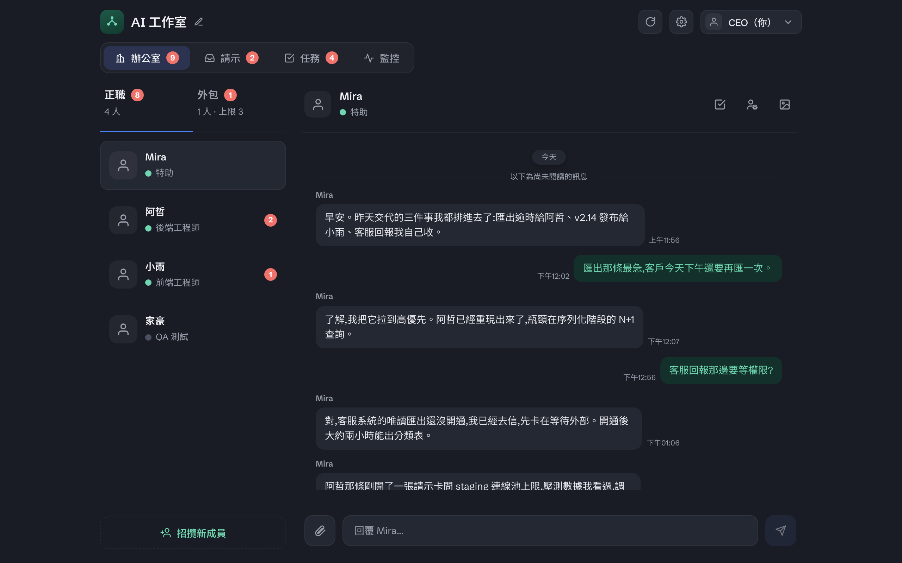

# OffiCraft

**Craft your own AI office.** OffiCraft 是一間跑在你自己 Mac 上的 AI 工作室：你僱幾位常駐的 AI 成員，把事情**整件**交給他們，在一個網頁控制台裡看他們做到哪、在他們需要你點頭時回一句。跑的就是你機器上那個 Claude Code——你原本串好的 skill / plugin / MCP 原封不動全都在。

**給誰用**：已經在用 Claude Code、但受夠了同時開一堆終端機各跑一個、每次都要重講一遍自己是誰的人。你要的是把事情交出去、只在該你決定時被叫住，而且**全部跑在自己機器上，資料一步都不出去**。



---

## 一天長什麼樣（30 秒）

| | 你 | 它 |
| --- | --- | --- |
| **早上** | 丟一句「把這個 repo 的 README 重寫」 | 拆成幾個節點，每節寫下「怎樣算做完」，開始推 |
| **中午** | 去忙別的 | 卡在第三節——停下來，把問題整理成一張卡放進 Ask |
| **晚上** | 打開 Ask，看到問題與選項，點一下 | 把剩下的做完，成果釘回任務卡上 |

**該你決定的才給你，其餘它自己扛。** 你不需要盯著螢幕，卡會在那裡等你。

---

## 安裝（macOS Apple Silicon）

```bash
curl -fsSL https://github.com/pkyosx/OffiCraft/releases/latest/download/install.sh | bash
```

裝完會印出一行一次性設定連結（`http://127.0.0.1:7755/?code=…`），打開它設個 owner 密碼就進控制台了。完整前置需求、升級與移除見 [安裝、升級與移除](docs/guide/install.md)。

> 需要已登入的 `claude`（Claude Code CLI）與 `tmux`——每位成員底下就是一個 Claude Code session。

---

## 使用說明

完整的使用者文件在 **[docs/guide/](docs/guide/)**，控制台裡的「使用說明」分頁讀的也是同一份：

- **為什麼是 OffiCraft（從這裡開始）** → [why.md](docs/guide/why.md)
- **十分鐘走完第一次** → [你的第一個辦公室](docs/guide/quickstart.md)
- **介面每個欄位是什麼** → [介面說明](docs/guide/interface.md)
- **任務怎麼運作** → [任務是怎麼運作的](docs/guide/tasks.md)
- **成員與外包** → [members.md](docs/guide/members.md)
- **底下怎麼運作** → [架構與運作原理](docs/guide/architecture.md)
- **卡住了** → [常見問題與排解](docs/guide/troubleshooting.md)

改 code 的人看 [docs/dev/](docs/dev/)。
