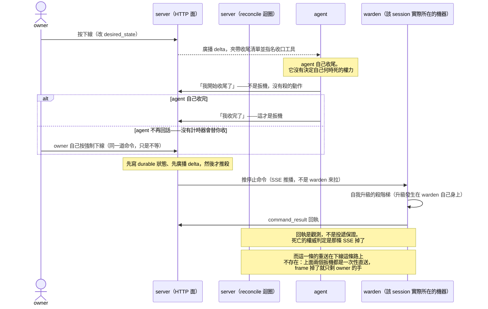

# 下線流程：一個 agent 是怎麼被收掉的

## 這份文件是什麼

**它是導覽，不是規格。** 它回答的問題是：「下線」這件事由哪些塊組成、每一塊負責什麼、塊與塊之間靠什麼銜接、哪一步不可逆、出錯時往哪個方向倒。

存在的理由：`spec/lifecycle.md` §4 已經規範了決策規則，但**它是規格不是導覽**——它告訴你每一條規則必須滿足什麼，不告訴你這些塊怎麼串成一件事。跨 agent／HTTP 面／reconcile／SSE／warden 的**串接視角**，repo 裡確實沒有一處。每個想知道「我按下去之後會發生什麼」的人，都得自己把五、六個檔案追一遍。這份文件就是那趟追蹤的成果。

**零複製規則**：本文**不定義任何規範性數字**。寬限、重試間隔、逾時一律**引用名字**（`stop_grace`、`recycle_grace`、`soft_offboard_grace`、`stop_retry`），數值去 `spec/lifecycle.md` 查。

這條規則有代價經驗撐著，而**這份文件自己就是那個代價**——而且是**兩層**的，因為第一次改它的人（我）改錯了方向。

**第一層（零複製規則本身）**：初稿在這裡指控 `docs/guide/architecture.md` 抄的那個秒數已經變成假話。**那個數字確實過期了**：那一段列了換手的三種觸發，而**你按 Refocus** 那一種現在**完全不上時鐘**（見第三節），不是它寫的那個值。**抄下來的數字不會在它失效時報警**——這正是零複製規則要防的事，而它就在這份文件的鄰居身上發生了。

**第二層（更難防的那個）**：但初稿指控它的**理由**是錯的。它說那句話在講「下線」，於是斷定下線的裁定讓它變假；實際上那一段從頭到尾在講**換手**（小標是「收尾怎麼做」），`architecture.md` 整份根本沒有描述下線這條路。**我把一份講換手的文字讀成講下線。**

⇒ 於是同一個句子上疊著兩個獨立的錯，而它們的形狀完全不同：**數字過期是「會發生的事」，脈絡讀錯是「一開始就錯」**，而後者連過期都不必，並且**看起來跟一個查證過的指控一模一樣**——它引用了真實存在的句子，只是安在錯誤的那條路上。

⚠️ 而下一輪還有第三個錯：發現指控的路徑錯了之後，我改寫成「**那句話從來沒有假過**」——**用一個新的全稱詞去平反一個舊的全稱詞，而且一樣沒去量。** 真正該說的是那句已經拆成兩層的話。**「它是錯的」和「它從來沒錯」都要舉證，而我只替前者舉了證。**

⚠️ 附帶一提，本文自己的初稿在這一節**連續兩次把理由講錯**，而結論每次都對，所以兩次都差點滑過去：先說 `stop_grace` 與 `recycle_grace`「只是現值恰好相同」，改成「是同一個常數、要分岔得先改碼」——**也不對**。它們是**兩個可以獨立設定的欄位**，只是預設值取自同一個常數。所以今天看到的相同不是巧合，但要讓它們分岔，改一行預設就夠了，不必動結構。

留著這段當提醒：**一個結論可以在理由錯了兩次之後依然成立，而那正是它最危險的時候**——沒有人會因為結論看起來對而去查它的理由。

### 誰是哪件事的權威

| 你想知道 | 去讀 |
|---|---|
| 起停決策的規則、必須滿足的行為契約 | `spec/lifecycle.md`（凍結的 wire 契約） |
| SSE 連線本身的規則（唯一性、頂替、防抖） | `spec/sse.md` |
| 狀態該存哪、「線上」到底怎麼定義、為何這樣切 | `docs/design/state-model.md` |
| agent 收尾時實際要做哪幾件事 | `seeds/offboard.md`（**owner 可即時編輯**，所以本文不列舉那幾件事，只說 server 會把它推給 agent） |
| 使用者視角的白話說明 | `docs/guide/architecture.md` |
| 現在真正在跑的是什麼 | 程式碼。文件是快照，碼不是。 |

---

## 全景：一次下線的訊息往來

先看形狀，再讀細節。**這張圖只畫最不會變的那一層**——有哪些角色、訊息往哪個方向走、哪一步才是扳機。**秒數、條件、例外一律不在圖上**，它們在後面的章節，圖與文字刻意不重疊：多一份講同一件事的拷貝，下次只會有一邊被改，而沒有任何東西會叫。

**圖上刻意看不到的三件事**，因為它們不是時序：哪一步不可逆（第六節）、出錯時往哪一邊倒（第八節）、三條下線路徑彼此差在哪（第三節）。畫進去只會讓圖變成一份會漂的第二敘述。

---

## 一、有哪些塊，各自負責什麼

四個參與者，職責邊界是這條流程最重要的一件事：

| 塊 | 它負責 | 它**不**負責 |
|---|---|---|
| **agent 自己** | 宣告自己的狀態（「我開始收尾了」「我收完了」）、把該留的東西寫回 server | 決定自己什麼時候死。它連自己的 context 用量都讀不到，是 server 推給它的 |
| **server（HTTP 面）** | 受理 agent 與 owner 的宣告，改 durable 狀態，廣播 delta | 直接殺行程。它一行 kill 都不執行 |
| **server（reconcile 迴圈）** | 比對「想要的狀態」與「觀察到的狀態」，決定該送出什麼命令 | **持有不能丟的記憶**。它有 in-memory 狀態（上一道命令、重試窗、失敗退避、殭屍二次確認窗），但那是**可丟的**——server 一重啟就從當下觀測重新推導 |
| **warden** | 執行——把命令變成真的把行程殺掉 | **決定要收誰**。lifecycle 的權威狀態不在它手上 |
| **owner** | 按下下線、重新聚焦、**強制下線** | — |

**一句話**：**決策全在 server，warden 只執行不決定，agent 只有宣告權沒有決定權。**

⚠️ 別把 warden 講成一顆完全被動的石頭——那是初稿的錯，這裡特別更正：warden **會**為了自更新定期問 server（那條路跟 lifecycle 決策無關）、有自己的 telemetry 迴圈與退避狀態、還有一道本地防護會**拒絕**踩掉一個還活著的 session。它不做的事只有一件而且很精確：**決定要收誰**。「不巡檢、不判斷、不持有狀態」這種全稱句是假的。

⚠️ 「可丟」不等於「丟了沒差」，而且兩個方向不一樣：那一丟把**殭屍的二次確認窗**重新開始算（碼註解說這是安全的方向），但同時把**失敗退避**歸零——一個反覆起不來的 member 因此拿到全新的重試預算，那是**更積極**、不是更安全。⇒ **重啟後的第一輪跟穩定狀態下的一輪不是同一件事**，而且不能一句「都往安全的方向倒」帶過。

這個切法是刻意的（`docs/design/state-model.md` 記了為什麼不把決策搬到 warden），代價與好處都很具體：所有判斷集中在一個地方好稽核，但也表示 **server 一失聯，整個機隊沒有人會自己做決定**。還有一個更貼近運維的形態：server 活著、但決策迴圈被整個關掉（`--no-reconcile`，shadow 部署用）——這時意圖寫得進去、presence 照跑、SSE 照送，**自動決策迴圈不再自己殺人、也不再自己重生**（⚠️ 這個開關的射程只到那個迴圈——owner 手動按下的那幾顆按鈕不在裡面，見 `spec/lifecycle.md` §4.1）。
🔴 **所以演練站不是安全的沙盒**：在一台 `--no-reconcile` 的 shadow 站上按下外包 worker 的停止／重啟／換模型／換機器／重新聚焦，命令**會真的送到真的 warden，殺掉真的 session**。⇒ **要演練，就得自己知道哪幾顆按鈕是活的**——碼裡沒有任何東西會攔你，而在 2026-08-18 之前，碼與這份文件都寫著相反的話（那正是沒有人去查的原因）。看到一個「狀態都對但什麼都不動」的機隊時，先問這個開關。

---

## 二、塊與塊之間靠什麼銜接

### 命令是推的，不是拉的

warden **不輪詢** server。它掛著一條長連 SSE，server 把命令直接推進那條連線。所以：

- **warden 不在線 = 命令送不出去**。這時 server 的選擇是**不送、也不推進狀態**——寧可什麼都沒發生，也不要留下一個「我以為我送出去了」的假紀錄。
- 命令是 **fire-and-forget 的投遞**：server 送出去之後不同步等待，「被接受」不等於「執行了」。**沒有 correlation id**——碼裡沒有 command id，server 每一輪都從當下觀測重新推導該送什麼。

### 但「沒有 id」不等於「沒有回音」

這是一個很容易寫過頭的地方（本文初稿就寫錯了）：**回執是有的**。

- warden 執行完會 POST 一則 **`command_result`**，server 把它折進那一列的 `last_op` 系列欄位。
- server 另外掛一道**以目標為 key 的死線**：命令成功送出後開始算，回執沒在期限內回來，就把 `receipt_missing` 蓋到那一列上。它的語意是「**不知道**」，不是「失敗」。
- 下架那道的回執甚至是**負載的**——warden 會等它送達，沒收到 2xx 就不讓自己退場。

所以正確的說法是：**沒有 correlation id，但有回執；回執是一種觀測，不是投遞保證。**

### 那怎麼知道它死了？

**看 presence，不看命令的回傳值。** 死亡的權威判定是「那條 SSE 掉了」，不是「stop 這道命令回了成功」。這是整條流程裡最容易搞錯的一點：

> 命令送達成功 ≠ 行程死了。

server 的處理方式是**每一輪重新推導**——還活著就再送一次（間隔至少 `stop_retry`）。命令因此必須是**重複執行無害**的：warden 收到第二道 stop 而目標早就死了，那是一個乾淨的 no-op。

⚠️ **但這個「再送一次」今天不涵蓋下線那條。** 重新推導的前提是決策迴圈會派命令，而下線那一臂在成員還線上的整段期間**什麼都不派**（見第三節）。它的兩個收口——成員自報收完、owner 按強制下線——都是**一次性**的直接投遞，不經過那個會重送的迴圈。⇒ **下線那條的 frame 掉了，就只剩 owner 的手。** 會重送的是換手那條與舊的計時路徑。

這是一個「至少一次」的設計蓋在一條「至多一次」的通道上，而讓它成立的是 idempotent 而不是可靠投遞。

⚠️ **但這個結論的射程只到「會重送的那幾條」。** 下線那條今天不在裡面（見上）：它沒有「至少一次」那一半，所以蓋不住通道的「至多一次」——**那一格的補償不是重送，是 owner 的手**。

---

## 三、三條下線路徑

它們最後都收在同一個地方（殺），但**誰開場、時鐘從哪裡起算、收完會不會重生**完全不同。混淆這三條是最常見的誤解。

| | 觸發 | 時鐘 | 收完之後 |
|---|---|---|---|
| **下線** | owner 把 desired_state 改成 offline | **沒有時鐘**。server 不倒數；對一個已經連上線的 agent 也不會自己送出停止命令（**例外見下方**） | **不重生**。就此結束 |
| **換手（recycle）** | context **第一段**門檻、context **第二段**門檻、owner 按重新聚焦、owner 改機器、owner 換 model／runtime／effort、agent 自己 `restart_self`、**token 到期前一小時** | **只有 context 第二段門檻與 owner 按下的加速停止上時鐘**（從 refocus 那一刻起算，一段 `RecycleGrace`）。**其餘每一個成因都完全沒有時鐘**，收口是 agent 自己的 stopped 回報或 owner 按強制停止 | **原地重生下一代**（desired_state 全程是 online） |
| **下架（uninstall）** | owner 要移除整台機器 | 沒有寬限（明確的 owner 動作） | 一次性意圖：warden 一離線就被消化掉 |

### 🔴 換手那條也幾乎全沒有時鐘（owner 2026-08-21）

判斷源只有一個：`winddownKindFor(refocus_op)`。時鐘（`recycleGraceFor`）與句子（`offboardKindOf`）都讀它，所以「有沒有在倒數」與「有沒有告訴 agent 它在倒數」不可能各說各話。

**final 是要指名的正條件，soft 是預設。** 以前反過來——什麼都 fall through 成「上時鐘」，只把 owner 按的重新聚焦挑出來當例外——結果是**每一個新成因都會不小心帶著一條死線出生**，包括 owner 已經裁定不該有的那些。現在要讓一個成因上時鐘，得在那一行**打字打出來**。

⚠️ **context 是兩段，不是一段。** 第一段（`context_notice`）只把收尾程序送到 agent 手上，**不上時鐘**；context 繼續爬才會**原地晉升**成第二段（`context_high`）並重打 `refocus_since`，那一刻才開始倒數。以前第一段只發一張 SSE band、完全不開換手，所以一個忽略了那一幀的 agent 會直接在第二段遇上「什麼都還沒開始收，而且只剩 120 秒」。

### 🔴 owner 可以自己按「加速停止」（owner 2026-08-21）

裁定原話是「可以給我按鈕嗎」＋「**停止 → 加速停止 → 強制停止**」。這是一條**升級
路徑**：先按停止，等不下去按加速停止，再不行按強制停止。

加速停止是中間那一段：它**不開始**一場收尾，它把**已經開的**那一場放上時鐘，並且
**把那個時刻告訴他**（同一次寫入就會扇出帶死線的收尾通知）。沒有在收尾的成員按下去
是 409 —— 對一個什麼都沒被告知的成員上時鐘，就是它從來沒聽過的死線，正是這張票要
消掉的形狀。

它**沒有推翻**「下線不兜底」那條裁定（rc-27d1710174dd）。那條講的是 **server 自己**
決定時間到；`decideDown` 今天仍然不自己起任何時鐘。這條時鐘只有在 owner 按下去才
存在，跟強制停止是同一種權威——只是多了一句話，而不是沉默。

兩條臂都吃：下線那一臂重蓋 `stopping_since`、換手那一臂重蓋 `refocus_since`，都從
**這一次按下**起算。時鐘、wire 上的死線、講給 agent 的句子，三者都問同一個
`winddownKindFor`。

### 🔴 外包的 `/stop` 也改成優雅收工了（owner 2026-08-21「往正職靠：外包那顆改成優雅停止，強制殺移到第三顆按鈕」）

⚠️ **這一段推翻了它上一版寫的話**——上一版寫「外包那邊只加了對稱的 endpoint，
`/stop` 的語意一個字都沒動」。那句在 owner 裁定的當下就過期了。

`HandleStopOutsourceWorker…` 現在做的是：翻 `desired_state=offline`（保持「停止壓過
一切自動復活」）、蓋 `stopping_since`、清掉 in-flight 的 refocus epoch、走
`openWorkerHandoverGrace` 朝 worker 自己的 session 發那份 member-topic 的下線預告，然
後**回傳**。它**不殺**、也**不蓋 `forced_stop_at`**。

- **為什麼不蓋 `forced_stop_at`**：那個 anchor 存在的兩個理由，對優雅停止都反過來。
  它是用來讓通知**沉默**的（`forcedEpochLive` → `offboardKindOf` 不掛 notice），可是
  優雅停止的重點就是那則通知要送到；它也是「這個 session 是被切斷的」憑據，而這個
  session 是被**請它自己收尾**的。那個 anchor 連同當場的 kill 一起搬到第三顆按鈕
  `POST /api/outsource-workers/{id}/force-stop`。
- **收口是 `workerReportStopped`**，而它需要一條新的臂。原本的收口閘是
  `desired online ∧ refocus_since > 0`，而一個停止 epoch **兩個都不是**。少了那條臂，
  外包按了停止之後會**永遠不被收掉**——比原本當場殺掉更糟。護欄：
  `TestWorkerStop_ReportStoppedCollectsTheStopEpoch`。
- **refocus epoch 還是被清掉，但理由換了**。原本的註解說「明示的停止壓過換手」——停止
  把收尾丟掉然後殺。現在停止**本身就是**一種收尾，沒有東西被壓過：worker 繼續走同一份
  〈停止〉，只是後面不再接一個新 session。清掉的理由變成機械的：
  `autoHandoverWorker` 的 in-flight 臂是用 kill+**respawn** 收口的，留著它會把 owner 剛
  壓下去的 worker 又叫起來。
- **`desired_state` 一開始就翻成 offline，這是刻意的**，而且它不會讓別的東西提早收掉
  worker：`autoHandoverWorker` 現在對 desired-offline 的 worker **最先**分流到停止臂並
  return，排程 tick 的其他復活分支本來就跳過 held-down 的 worker。真正的風險方向是**被
  respawn**，不是被提早收——上面那條清 refocus 的理由講的就是它。
- **加速停止在外包身上也走得通了**。`/accelerated-stop` 原本對 `desired_state=offline`
  回 409（在停止還是當場殺的年代是對的），那會讓 owner 只剩 停止 →（409）→ 強制停止。
  它現在跟正職一樣吃兩條臂；下線那一臂重蓋 `stopping_since`、寫
  `refocus_op=accelerated_stop`，`autoHandoverWorker` 的停止臂在 `stopping_since + grace`
  收口。護欄：`TestWorkerStop_AcceleratedStopEscalatesTheStopEpochAndIsHonoured`。

### 🔴 token 到期前一小時也會開一條「停止」（owner 2026-08-21）

原本 token 續期靠 agent 自己記得。問題是：**收尾程序的每一步都是拿那顆 token 打的 MCP
呼叫**（`report_stopping`、`post_chat`、寫 lesson、`report_stopped`），所以 token 過期
不是讓收尾變差，是讓收尾**完全做不到**——它只能一路 401。

🔴 **而從 T-14 項目 4B 起，「一路 401」不再只有到期這一個成因。** 同一個成員的**接班那一輪
一呼 `report_waking`**，就會把上一輪的 token 一起帶死（`agent_iat_floor`，見
`spec/lifecycle.md` §1.2 第三道）——症狀跟 token 過期**一模一樣**：收尾的每一步都 401，
而且沒有任何訊息說是為什麼。差別在成因，所以除錯時要分開看：到期是**時間**到了，這一個是
**下一輪**到了。這條路 owner 2026-08-30 明知代價後圈下來（`rc-fe6451abe579` [1]），
**不會**由這段的一小時提前量來救——那個時鐘只認 token 的 `exp`。

所以 `stampTokenExpiryWinddown` 在 tick 裡（緊接在 context 那兩段之後）對還在線、
token 剩不到一小時的正職開一條 **停止**：`refocus_op = token_expiry`，**沒有時鐘**，
收口一樣是 agent 自己的回報或 owner 的手。owner 的原話是「就是呼叫軟下線，然後等他
report_stopped 以後再呼叫上線」。

⚠️ **到期時間是推算的，不是記下來的**：`session_boot_ts + auth.agent_token_ttl`。
token 在 START 派發那一刻鑄造，`session_boot_ts` 是之後 SSE 第一次連上才蓋的，所以這
是一個**上界**——觸發只會**偏晚**，不會早於 token 存在。它讀的也是**當下**的
`auth.agent_token_ttl`，不是鑄造當時那個值；中途改這顆設定會讓推算對已經鑄好的 token
失準。兩個誤差都是刻意留的：要記真正的 `exp` 得加一個 durable 欄位，而這條成因是軟的，
推錯的代價是白換一次手，不是被切斷。

⇒ **一個成員停在收尾狀態很久，預設不是異常。** 除非它的 `refocus_op` 是 `context_high` 或 `accelerated_stop`（上面那張表的兩個加速停止成因），否則本來就沒有任何東西會來收它——收口是它自己的回報，或 owner 的手。

### 🔴 下線那條沒有兜底計時器，這是刻意的

對一個**已經連上線**的 agent，server **不會**自己替你收它。收口有三個來源，**沒有一個是 server 自己起的**：

1. **agent 自己說「我收完了」**
2. **owner 按加速停止**——它重蓋 `stopping_since`、寫下 `refocus_op = accelerated_stop`，決策器就在 `stopping_since` ＋ 那段寬限收，句子也同時把那個時刻告訴 agent（見上面「owner 可以自己按加速停止」那節）。**這條時鐘是 owner 起的，不是 server 起的**，所以它沒有推翻下面那條裁定
3. **owner 按強制下線**

（例外：對一個**還在 waking**、START 已派但還沒連上來的 session 按下線，server 會**立刻**送出停止命令。那不是倒數到期，是**取消一個還沒開始的 session**——沒有人在裡面等著被通知。）

這是 owner 2026-08-16 的裁定（原話是「不要兜底：只有你按強制下線才收它」）。它之所以安全，是因為那顆按鈕**真的按得到**——座艙就在這個狀態下提供它。

⇒ **「唯一的兜底是 owner 的手」是這條流程的一個組成部分，不是缺漏。** 一份漏掉它的說明會讓讀者以為 server 會替他收，然後在 agent 卡住時等一個永遠不會到的逾時。

強制下線走的**不是第二種命令**——它走同一道停止命令，只是繞過等待。它還會另外寫下一個「這個 session 是被切斷的、不是自己收完的」的 durable 記號，因為**一個被砍掉的 session 留下的東西，跟一個沒什麼好寫的 session 留下的東西長得一模一樣**，那個記號是唯一能分辨兩者的欄位。

（`spec/lifecycle.md` §4.3 原本仍描述舊的「arm 一個 deadline、逾時自動送 stop」行為；owner 2026-08-17 授權補齊，已跟上。

🔴 **而那句話不只一份拷貝——它散在 spec、實作者手冊、端點說明、UI 文案、開機 seed 與碼註解裡**，每一輪掃都還會再冒出來。已處置與未處置的清單留在票上（T-a91a），**這裡刻意不寫數字**：這份文件前面三次寫下一個沒數過的計數，三次都錯。

其中一份特別要緊：**那顆按鈕自己的說明**。它原本寫著「繞過 120 秒的寬限計時器」，等於告訴讀者「不按也會有人收」，**而那正是這條裁定唯一不能被誤解的地方**——當時那顆按鈕是唯一的收口（今天多了加速停止那一顆，但兩顆都得 owner 動手，server 依然不兜底），讀者卻被告知它只是加速。

⇒ **盤點一句假話時，先問它有幾份拷貝，再問哪一份的讀者會照它行動**；而**「幾份」要真的數，不要估**。）

**下架那條的一次性是有事故背景的**：如果殘留意圖沒被消化，它會變成一道**常駐的殺人令**——重裝上來的東西馬上又被殺，然後再重裝，成為迴圈。所以每個安裝入口都要先把殘留意圖歸零。

**在換手那條路上，寬限是天花板而不是等待時間**：只要 agent 講了「我收完了」，收口**立刻**發生，不會等滿。寬限存在只是為了處理「它再也不會回話了」。

**下線那條預設沒有這個天花板**——沒有 owner 動手就沒有上限；他按下加速停止之後才有一條，而那條的起點是**他按下的那一刻**，不是計時器自己起的。這兩條路差別很大，不要用同一句話蓋過去。

### 這三條蓋不住全部的 stop

還有幾條**不屬於下線流程**、但同樣會送出停止命令的來源，至少包括：換機器的 **backstop** 臂、對一個「還活著但已經聽不到 presence」的殭屍 session 的二次確認停止、以及連線時的身分掃蕩。這裡不展開，但要知道「看到一道 stop」不等於「有人在走下線流程」。

⚠️ 那條 backstop 臂**不等待**，但它處理的是「沒有人替它蓋換手窗的機器分歧」這種例外——**owner 正常按改機器走的是會等待的換手路徑**。把 backstop 的行為當成正常路徑，正好會得出「改機器沒有寬限、當場砍」這個**已經被修掉**的舊行為。

---

## 四、agent 自己那兩句話：差別很大

agent 在收尾時會講兩句，**只有第二句是扳機**：

| | 效果 |
|---|---|
| **「我開始收尾了」**（`report_stopping`） | **沒有任何殺的動作。** 它在錨還沒被設過時打上時間錨，並廣播一則 delta——**而在下線這條路上那個錨早就被蓋好了，所以它什麼都沒改**（見下方）。另外這段期間**斷線重連是允許的**，但那不是它造成的——不然一次網路抖動就會把做到一半的交接弄死 |
| **「我收完了」**（`report_stopped`） | **這才是扳機**。server 在同一支呼叫裡就把停的命令推給那台機器的 warden。**在下線這條路上**，此後這個 token 再連 SSE 會被擋掉（換手那條不會——它本來就要重生）。🔴 **但這句話從 T-14 項目 4B 起有一個前提：那顆 token 還沒被接班的那一輪作廢。** 接班的那一輪一呼 `report_waking`，這個成員的 `agent_iat_floor` 就抬到那一呼的 `iat`，比它舊的 token **在 auth 那一層就 401**——句子裡的 handler 一步都沒跑到，扳機當然也沒有扣。**這不是缺陷，是 owner 2026-08-30（`rc-fe6451abe579` 選 [1]）明知代價後圈的**：「新的一輪一上線就失效，交接斷在半路是我知情接受的」。要看它擋在哪、為什麼 warden 不吃這一套，見 `spec/lifecycle.md` §1.2 第三道 |

**agent 怎麼知道該講哪一句？** 是 server 告訴它的：收人的那一刻，收尾清單會**附在那則 member 變更裡推給它**，而且分「軟性」與「最後通牒」兩種形態，**並指名這次該用哪個工具收口**（下線用「我收完了」、換手用重啟自己）。這是上面那張表能成立的前提——不然 agent 沒有辦法知道自己在走哪一條路。

⚠️ 一個容易誤讀的地方：「開始收尾」**不是免死金牌**，它不會讓誰替你多等，也不會讓你的連線被特別對待。

**在下線這條路上，它送出一則 delta，而 server 端那一列沒有任何欄位改變。**

這是查得到的形狀：`stopping_since` 是 `IF UNSET` 才寫，而 owner 按下線那一刻它已經被蓋上了，所以 agent 這一次的 stamp 是 no-op；那一列沒有欄位變動，任何從欄位衍生的呈現（含座艙燈號）就不會變。

兩個我**沒有**宣稱的東西，刻意分開講：
- 那則 delta 的**內容**不保證跟前一則相同——它夾帶的收尾通知是送出當下即時重算的，而 context 位置會漂。但那是「任何一次寫這一列都會順帶重算」的副作用，**不是這支呼叫做的事**。
- 座艙**有沒有**從「收到一則 delta」這個事件本身衍生什麼呈現，我**沒有讀前端，不知道**。所以這裡不寫「它換了燈號」，也不寫「它什麼呈現都不會造成」——**把不知道寫成不知道，不要寫成沒有。**

🔴 **這句話的修訂史比它的內容更值得讀。我為它寫過六個版本，前五個都在多宣稱一點東西，而每一項查下去都不是這支呼叫做的：**

1. 「時鐘照走」——下線那條根本沒有時鐘可走。
2. 「它是 SSE 重連被放行、以及自請重啟被接受的依據」——**兩半都假**。打不打它都連得上；自請重啟看的是有沒有 live 連線加意圖仍是上線，碼註解甚至直說這個宣告曾經是自請重啟被**誤拒**的原因。
3. 「它打的那個時間錨被強制下線的判定拿去用」——那個 stamp 是 `IF UNSET`，按下線時錨已被無條件蓋好，agent 這一次是 no-op。
4. 「它換座艙燈號」——燈號從那個欄位衍生，而欄位沒動。
5. 「它送出一則**內容與前一則相同**的 delta」——連這個都多說了：那則 delta 夾帶的收尾通知是送出當下即時重算的，內容不保證相同。

五次都是獨立審查打回的，五次都是我在為同一句話多留一點東西。⇒ **第三次為同一段內容辯護時，該懷疑的是自己，不是它。**（我到第四次才真的照做，而第五次是連「相同」兩個字都還多說了。）

真正沒被檢驗的不是那些事實，是**「這東西一定有更深的用途」這個假設**——它一直是我查證的起點，而不是查證的對象。

**順序也是刻意的**：server 先把狀態寫進資料庫、先把 delta 廣播出去，**然後**才推那道殺。反過來的話，agent 可能死在自己的紀錄落地之前。

---

## 五、殺是怎麼執行的

**先問：這道 stop 送去哪一台？** 殺這條路徑解析的是**那個 session 實際所在**的機器，不是它被指定該在的那台——這兩者在換機器時會不同，而搞混的後果是舊 session 永遠殺不掉。沒有 live 連線可問時，它誠實地退回那個「該在的」機器。

⚠️ 這是**殺路徑專用**的解析，不是通則：其他非停止類的命令送往指定的那台。（而連線時的身分掃蕩又是第三種——它刻意送給**所有其他** online 的 warden，兩種解析都不是。）

warden 收到一道 stop，內部是一段**自我升級的階梯**，不是單一個訊號：

1. 先盤點：目標行程、它的子孫、以及用**工作目錄比對**抓出來的脫隊行程
2. 溫和地關掉它的 session
3. 偵測是否真的收掉了
4. 沒死 → **升級成不可逆**：整個 process group 強殺，並沿著行程樹補殺 setsid／double-fork 出去、強殺訊號打不到的孤兒
5. 權威地再確認一次 session 真的不在了
6. 最後**無條件掃一遍**（即使第 2 步就成功也照跑）：每個還活著的行程**精準對 PID** 送終止訊號、等一個短寬限、還在就強殺，一路確認到全部消失。**絕不按名字批次殺。**

**設計要點**：升級發生在 warden 自己身上，**沒有另一道「強制殺」的命令**。server 只送一種 stop；「要不要升級」是執行細節，不是決策。owner 的強制下線也不是第二種命令——它走同一道，只是不等。

---

## 六、不可逆的點

| 這一步之後 | 就再也不能 |
|---|---|
| agent 講出「我收完了」 | 補寫任何東西。停止命令在**同一支呼叫裡**就送出去了，它的行程撐不過殺的階梯 |
| 任務進入終態 | 增刪與就地替換交付物與證據——會被凍結。要釘就在那之前釘 |
| 階梯升級到強殺 | 讓那個行程做任何收尾 |
| 下架意圖被消化 | 靠它自己再殺一次（那是一次性的） |

寫給 agent 的實務結論只有一句：**只寫在 terminal、本地檔案或自己 session 裡的東西，等於沒有留下。**

---

## 七、正職成員與外包 worker 是刻意不對稱的

同一支 `report_stopped`，兩種身分的結果不同：

- **正職**：一律收。不管這次下線是誰開的頭，agent 說完成就收；要不要重生由 desired_state 單獨決定。
- **外包 worker**：**只有在交接進行中才立刻收**。不在交接裡的「我收完了」只記一個時間戳、不派任何東西，而且走的是 worker 自己的回收路徑，不是正職那條。

**連 SSE 那道門也是不對稱的**，而這是這節最強的證據：擋回連線的那道 gate 對外包**直接放行**——一個已結案的 worker，它的 session 要活到結案流程走完。worker 的停止意圖靠排程那一側的狀態壓著執行，**不靠這道門**。所以「同一支 API、同一個狀態，兩種身分兩種結果」在這條流程上出現了兩次，不是一次。

這個不對稱不是遺漏，是設計。想合併它們之前，先讀 `spec/lifecycle.md` 與 worker 那條路徑各自的理由——外包多了任務綁定、代號、結案這些正職沒有的生命週期。

---

## 八、出錯時往哪一邊倒

一致的方向是 **fail closed**：不確定就不動作，而不是猜一個看起來合理的動作。

| 情況 | 選擇 | 為什麼 |
|---|---|---|
| 意圖欄位讀到看不懂的值 | 當成 offline，**永不啟動** | 起錯一個 agent 比少起一個貴 |
| 要啟動但缺角色或密鑰 | 不啟動，狀態不前進 | 不留半成品 |
| 目標 warden 不在線 | 不派、狀態不前進 | 不製造幽靈啟動或幽靈停止 |
| 命令送出後沒有回音 | 看 presence，還活著就重送 | 回執是觀測不是保證，死活要問 presence |
| 目標機器沒回報它支援這個 runtime | 不派 | 派出去也起不來 |
| 選不到機器 | **把「卡在選機器」寫到那一列上**，而不是安靜地每個 tick 重試一次 | 安靜重試會讓一個永遠不會好的狀態看起來像「正在處理中」 |

**fail-closed 講的是「不確定就別動手」，不是「不確定就別出聲」。** 上面多數格子在不動手的同時會留下痕跡：兩格寫進那一列 member row（座艙讀得到），三格寫進 server 的 log。

真正**什麼痕跡都不留**的只有第一格——意圖讀到看不懂的值時，那是一個純函式的判斷，不寫欄位也不寫 log。它之所以可以這樣，是因為那個情況本身不該發生；但也表示**如果它真的發生了，你只會看到一個安靜地不啟動的 member**。

（⚠️ 初稿在這裡寫「這張表裡唯一一個不要安靜的例子」——那是假的，而且它是我做完全稱詞自檢**之後**還留下來的：自檢有跑，判斷錯了。真正只有一個的是反過來那半。）

同樣的權衡在提醒類的邏輯裡出現過相反的結論：token 過期提醒會**重複到底**，因為那個狀況不會自己好轉。而換手提醒則刻意**一個 session 只發一次**——重複催促本身就是要消滅的病。

⚠️ 所以不要把「寧可重複也不要靜音」當成通則（本文初稿就這樣寫了，是錯的）。**真正的判準是逐案問「兩種錯哪一種代價小」**，而不同的訊號會得出相反的答案。

---

## 九、這份文件什麼時候會過期

它描述的是**機制與判準**，所以：

- 改了**誰決定、誰執行、靠什麼銜接、哪一步不可逆**——這份要一起改。
- 只改了數值（寬限、重試間隔）——這份**不用改**，因為它只引名字不引數值。這是刻意設計的。
- 加了第四條下線路徑、或讓正職與外包的不對稱改變——這份要一起改。

改到那幾塊的人就是該更新它的人。如果你發現本文某句話跟碼對不上，**碼是對的**，請直接修這份文件；如果對不上的是 `spec/lifecycle.md` 或 `docs/design/state-model.md`，那是另一回事——那兩份一份是凍結契約、一份是 owner 定案的裁定紀錄，先確認是文件落後還是碼跑偏了，不要自己選邊。

---

## 附：這份文件的錯誤清單（五輪審查抓到的十六項，＋兩項在那之後才碎的）

本文經過一次逐句事實核對加**五輪**獨立審查。**每一輪都有新的錯，而且後面幾輪的錯全部出在「為了修上一輪而新寫的句子」裡。** 最後兩項不屬於這個形狀：**第十七項**通過了前面全部審查、也通過了 land，是後來有人拿這份文件去執行時才碎的；而**修它的那一次又寫出了第二個全稱詞**（見該節的 🔴），由再下一輪審查抓到——**修正本身就是下一輪的母體，這條規律到目前為止一次都沒有失效。**

先講這件事本身，因為它比任何一條個別的錯都重要：

> **修正是新的斷言，不是已驗證的內容。** 一個「剛被打回、當場改好」的句子，它的可信度不會高於初稿的句子——但讀起來會，因為它旁邊有一段「已查證」的歷史。第三輪的三個問題全部出在第二輪的新句子上，而第二輪的新句子是為了修第一輪的問題寫的。

### 第一輪：初稿的五種形狀

1. **從規格抄，不是從碼追。** 兩個最嚴重的錯（下線有沒有計時器、有沒有回執）都是照 `spec/lifecycle.md` 寫的，而規格在這兩點上落後於碼。**規格是「應該怎樣」，碼是「實際怎樣」，寫導覽要問後者。**
2. **全稱句。** 「warden 不巡檢、不判斷、不持有狀態」——三個絕對詞，三個都假。真正成立的只有一件很窄的事：它不決定要收誰。
3. **把「沒有 A」放大成「沒有 A 這一整類」。** 確實沒有 correlation id，但我從那裡推出「沒有任何結果可查」，而回執機制整套都在。
4. **用一句話蓋住兩條性質不同的路徑。** 「寬限是天花板」在換手成立、在下線根本沒有寬限可言。
5. **拿一個還沒進 main 的東西當現況。** 「唯一刻意往反方向倒的是提醒類邏輯」是從我當時手上另一包還沒 land 的碼推的。

共同點是**話跑在事實前面**：句子寫得像已經查證過，而查證是後來才發生的（或根本沒發生）。第 5 條尤其——**我沒有辦法從自己的文字看出哪一句是查來的、哪一句是推來的**，那需要另一個人拿著碼逐句問。

### 第二輪：修正引入的新錯

6. **換掉理由，就宣稱結論不變。** 我把某段的理由換掉、確認新理由為真，然後寫下「結論不變」——**而那個結論早就被另一張票推翻了**。我只問了「新理由撐不撐得住舊結論」，沒問「這個結論自己還成不成立」。
   ⇒ **換理由這個動作會讓結論看起來更可信**（多了一行查證過的痕跡），所以它應該是**把結論打回未驗證狀態**的訊號，而不是加固它。
7. **被打回後當場補上的替代理由，兩半都假。**
8. **假的全稱詞出現在自檢跑完之後。** 掃到了，判定它成立就放過了——**自檢有跑，判斷錯了**。

### 第三輪：修第二輪時又寫出來的

9. **拿一個在 main 上永遠不會發生的分支當現況**（一個沒有任何呼叫端會觸發的欄位）。這是第 5 條的變體。
10. **同一段裡自相矛盾**：前一句說「每一格都會留下痕跡」，下一句說「只有第一格什麼都不留」。而它就寫在我剛為了修另一個假全稱句而重寫的那一段裡。
11. **為同一句話找了三次理由。** 見「兩句話」那節——三個版本都是在替它找一個「其實有用」的用途，而誠實的答案一開始就在那裡。**第三次為同一段內容辯護時，該懷疑的是自己，不是它。**

### 第四輪：同一句話的第四個版本

12. 「它至少還會換座艙燈號」——燈號是從那個欄位衍生的，而那一列**沒有任何欄位改變**。見「兩句話」那節；那一句我總共寫了六個版本。
13. **（我自己抓到的）改完內文沒回頭改表格。** 我在內文否定掉「換燈號／打錨／發 delta」這三件之後，上方表格那一格還原樣寫著它們。而**「表格會被單獨讀走」這件事，我上一輪才剛自己抓到過一次**——同一個病，隔一輪再犯。

14. **寫下第 13 條的那個 commit，本身就違反了第 13 條。** 我新增了「第四輪」這一節，而它上游的標題還寫著「被打回**三輪**」。

    ⇒ 這一條是全篇最實用的一個示範：**知道一條規則不會讓你執行它。** 「標題也是結論」我不但知道、還在同一個 commit 裡把它寫下來，然後沒有對自己執行。規則要能生效，必須寫成一個**動作**，而不是一個**認知**：

    > 改完任何一段之後，**回頭把它上游的標題、摘要句與表格各讀一次**，逐一問「這句現在還成立嗎」。不是「記得標題也是結論」——是真的回去讀那三個地方。

### 第五輪：兩處措辭，其中一處是第 14 條當場再犯

15. **「內容與前一則**相同**的 delta」的「相同」撐不住**——那則 delta 夾帶的收尾通知是送出當下即時重算的，context 位置會漂。（那個變動不是這支呼叫做的，但我不能宣稱「相同」。）
16. **我在修第 14 條的同一輪，把附錄的標題改成「四輪」，卻沒改它正下方那句「加三輪獨立審查」。** 標題與摘要句隔了兩行。
    ⇒ 這正是第 14 條要防的，而它在第 14 條被寫下的**下一輪**就再犯一次。抓到它的是**那個檢查動作本身**（我回頭把所有標題與摘要句讀了一遍），不是我的記憶或警覺——**這就是「寫成動作」跟「寫成認知」的差別，實測有效。**

### 這些錯的分佈不是隨機的（審查者的觀察，我認為是整份文件最有用的一句）

**五輪下來被打回的句子，幾乎全部落在我自己事前就標記為「最沒把握」的那幾句上。**

所以「沒把握」這個自我標記**其實很準**。不準的是標記完之後的動作——**我去找了一個理由把它補起來**，然後那個理由變成新的斷言，再被打回。

⇒ 可執行的版本，也是給下一個維護者的唯一一條（刻意不是「要更小心」——五輪下來我每一輪都很小心，那句話沒有用）：

> **對自己標為「沒把握」的句子，預設答案是「零／沒有」。要寫成「有 X」才需要舉證，而不是反過來。**

連帶：**任何新寫或改寫的句子，都要當成從未被查證過的斷言重查一次，包括（尤其是）那些為了修正錯誤而寫的。**

### 第十七項：land 之後、由「去執行它」的那個人抓到的

前面十六項都是審查在 land 之前抓到的。**這一項不同：它撐過了五輪審查、撐過了 land，是後來有人拿著這份文件去做事時才碎的。**

⚠️ **先招認一件當場發生的**：寫下這一節的那個 commit，把它編成「第十八項」、並在標題與摘要句寫「十七項」——**實際數過只有十六項**，三處用的都是同一個沒數過的數字。這是第 13／14／16 條的第四次重演，而且**就發生在我為了記錄「改內文要回頭看標題」而新增的這一節裡**。抓到它的是下一輪獨立審查，不是我。⇒ **「回頭看標題」還不夠，數字要真的數一次**：一個被三處引用的數字，錯了會三處一起錯，而它們互相看起來一致。

本文第一節原本指控 `docs/guide/architecture.md` 抄了一個秒數、那句話已經變成假話。後來 owner 授權去補那些落後的文件，**執行的人打開那一段一看——那一段從頭到尾在講換手（小標是「收尾怎麼做」），不是下線；`architecture.md` 整份沒有描述下線這條路。指控安錯了路。**

🔴 **然後我在同一個 commit 裡犯了第二個**：我把結論寫成「**那句話從來沒有假過**」。**也不對。** 那一段自己列了換手的三種觸發，而其中一種（owner 按 Refocus）等的是另一個值——**那個數字對它仍然過期**。⇒ 我**用一個新的全稱詞去平反一個舊的全稱詞，兩個都沒量**。正解是拆開講：**路徑指控是錯的，數字過期是真的**。抓到這一個的是下一輪獨立審查。

**為什麼五輪審查抓不到它**：審查者查的是「這句話有沒有依據」，而它**有**——那個秒數真的寫在那份文件裡，我引用得一字不差。錯的不是引用，是**我把它安在錯誤的那條路上**。⇒ **一個脈絡錯置的指控，在逐句查證下長得跟一個查證過的指控一模一樣**，它引用的每個字都對得上。

**真正抓到它的動作只有一個：去執行它。** 有人打算照著這句話去改那份文件，於是他必須打開那份文件、看它的上下文——**而審查者只需要確認那句話存在。**

⇒ 給下一個維護者：**當你寫下「某份文件是錯的」時，你其實下了兩個斷言**——那句話存在（好查），以及**它屬於你說的那條路**（沒人會查）。第二個才是危險的那一個。
