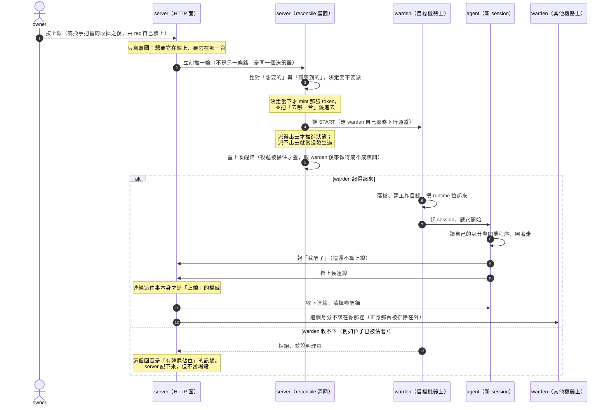

# 一個 agent 是怎麼被起起來的（上線流程）

## 這份文件是什麼

**它是導覽，不是規格。** 它回答的問題是：「上線」這件事由哪些塊組成、每一塊負責什麼、塊與塊之間靠什麼銜接、哪一步不可逆、出錯時往哪個方向倒。

它是 [`offboard-flow.md`](offboard-flow.md)（下線那條）的對稱面。兩份重疊的地方（命令怎麼推、回執是什麼、殭屍、fail-closed、重啟後的第一輪）**互相指路，不各寫一份會漂的敘述**。

存在的理由：`spec/lifecycle.md` §4 規範了決策規則、`docs/design/state-model.md` 定了狀態語意、`docs/guide/architecture.md` 給了使用者視角——但**沒有一處把這條鏈串起來**。每個想知道「我按下上線之後會發生什麼」「為什麼它卡在喚醒中」的人，都得自己追五六個檔案。這份文件就是那趟追蹤的成果。

**零複製規則**：本文**不定義任何規範性數字**。死線、退避、窗口一律**引用名字**，數值去 `spec/lifecycle.md` 查。（這條規則的代價經驗寫在 `offboard-flow.md` 第一節，那份文件自己就是那個代價。）

🔴 **讀之前先知道一件事：正職成員與外包 worker 走的不是同一條路。** 它們有**兩個各自獨立的產生器**，放置規則也不同。本文預設在講**正職**；凡是 worker 不一樣的地方都會明說。**不要把這裡任何一句關於正職的話直接套到 worker 上**——這份文件的初稿就是那樣寫的，事實核對整段打回。

### 誰是哪件事的權威

| 你想知道 | 去讀 |
|---|---|
| 這條流程怎麼串起來、哪裡會斷 | 本文 |
| 下線／被收掉那條怎麼串 | `offboard-flow.md` |
| 決策規則的規範性內容與所有數值 | `spec/lifecycle.md` |
| 狀態語意（intent vs observed、online 憑什麼） | `docs/design/state-model.md` |
| 使用者視角的「它在幹嘛」 | `docs/guide/architecture.md` |
| 座艙怎麼把這些狀態畫出來 | `frontend/.claude/rules/presence-and-badges.md` |
| agent 開機到底照什麼做 | **設定 › 角色誌 › 啟動程序**（owner 可編輯的權威版，出廠版在 `seeds/`） |

---

## 全景：一次上線的訊息往來

圖只畫**最不會變的那一層**：角色、訊息方向、關鍵扳機。**秒數、條件分支與例外刻意不進圖**——它們會變，而圖一旦畫上就沒人回來改。那些留在下面的文字裡。

圖畫的是**正職**那條。外包 worker 的差異寫在文字裡（§一、§三、§四）。

⚠️ **圖上刻意沒有的東西**：所有時間、兩種 runtime 的差異、退避與重試、外包那條線、以及每個失敗分支的細節。**它們不是被省略，是被放到文字裡**——因為它們正是會變的那一層。

圖上**只留了一條分支**，而且它在這裡不是「失敗處理」：warden 說「位子已經被佔著」時，那句話**改變了 server 的結論**（它據此判定有殭屍），所以它是這條流程的組成部分，不是一個錯誤路徑。**其他所有出錯的形狀都不在圖上。**

---

## 一、有哪些塊，各自負責什麼

| | 負責 | **不**負責 |
|---|---|---|
| **owner** | 表達意圖（要它在線上、要它在哪一台） | 決定什麼時候真的派命令。他按的是意圖，不是動作 |
| **server（HTTP 面）** | 受理意圖、寫 durable 狀態、廣播 delta，然後**踢一輪決策** | 自己決定要不要起。它不做決策，只是把決策提早觸發 |
| **server（背景產生器）** | 比對想要的與觀察到的，決定要送什麼命令；**並在決定的那一刻 mint token** | 執行。它一行行程都沒起過 |
| **warden** | **執行**：落檔、建目錄、把 runtime 拉起來、回報結果 | **決定要起誰** |
| **agent** | 讀自己的身分、照開機程序走、自報狀態、掛上連線 | 決定自己何時被起。它連自己有沒有被派過都不知道 |

### 🔴 「決策集中在一處」是對的，但那一處**不只一個產生器**

正職成員走 reconcile 那個產生器。**外包 worker 的「收案」走第二個**——它在碼上自述為 reconcile 的**同構雙胞胎**：一樣有一個純決策核心、一樣有週期 tick、一樣有事件驅動的立即 tick、**一樣有自己的關閉開關**。

⚠️ **但 worker 不是整條路都跟正職分開。** 它的**救援 START**（spawn 悄悄失敗、幽靈 session 卡住重試迴圈那些情況）**走的正是正職那顆純決策核心本體**——碼上檔頭自述「跑的是**成員用的同一顆 reconcile FSM**」。

⇒ 正確的切法是：**收案是兩個決策器；救援共用同一個。** 說「只有一個決策者」是錯的，說「worker 完全不經過正職那個決策器」也是錯的（**這是初稿改錯方向之後的第二版錯誤**）。

### 🔴 上線這條**有**繞道，只是不在正職那邊

下線有「強制下線」那種繞過決策器的直接投遞。上線這邊的對稱物是**外包的 owner op**（換機器、重生）：它**可以**直接投遞，不等下一個 tick。

⚠️ **但不是無條件的**：如果那個 op 不是「把已停的 worker 叫回來」、而該 worker 手上還有東西要寫回，它會先走一段**交接**（那一段的註解逐字寫「**這裡不發出任何 kill**」）。立即投遞是**另一支**。

⇒ **正職沒有繞道；worker 有，但那扇門有條件。** 初稿寫成「上線這條沒有等價的繞道」，是把正職的形狀當成了全部。

---

## 二、塊與塊之間靠什麼銜接

### 命令是推的，不是拉的

START 走 **warden 自己那條對外長連線的下行方向**——因為 server 打不進 NAT 後面的 Mac。有資格接收的判準是**連線者 token 解出來的身分是不是一台 warden**，而收件位址是**那台 warden 的身分**，不是連線端自報的主機名。

**沒有 correlation id**，回音是**回執**——這一段的語意與下線那條完全相同，寫在 `offboard-flow.md`「但『沒有 id』不等於『沒有回音』」一節，不在這裡重寫。

### 派不出去，就當沒發生

投遞是一道 **fail-closed 閘**：目標解不出來、或那台 warden 不在線，就**不投遞、狀態也不推進**。原則是「**產生器絕不記錄它沒送出去的命令**」。

⇒ 所以「決定要派」本身**不是**不可逆的點；不可逆從**投遞被接住**那一刻開始（見第九節）。

---

## 三、上線的觸發來源

正職那邊四種：

1. **owner 按上線**（或 admin agent 用同一條介面）。
2. **首次開機的 onboarding**。
3. **殭屍被收掉之後的下一輪**。
4. 🔴 **換手重生**——**它不派任何「重啟」命令**（見下）。

worker 那邊**至少四種**：**排程收案時的 admission**、**owner op**（換機器／重生，見§一的條件）、**週期 tick 對「已指派」worker 的重新投遞**，以及**救援 START**（走正職那顆 FSM）。

### 🔴 換手重生不是一道 restart

決策器認得的命令只有幾個，而**裡面沒有 restart**。換手的實際形狀是：

> 蓋上換手記號 → 舊 session 被停掉 →「想要它在線上」這個意圖**全程沒有變過** → **下一輪的普通 START 就是重生**。

⇒ **「server 送了一道 restart 給它」是憑空的**。會這樣寫的人，是把使用者看到的行為（它換了一手）當成了介面上的一道命令。碼上處理換手那一段甚至明寫「**這裡什麼都不派**」。

這也解釋了為什麼**換手期間 desired_state 一直是 online**：如果它變成 offline，就沒有東西會把下一代起回來了。

---

## 四、機器與 runtime 是兩道閘

### 機器：正職沒選就一台都不會挑；worker 有一層 soft fallback

**正職**：server **不會**替你挑一台。沒指定機器、或指定的那台不能用時，受理由逐字是「**沒有自動放置**」「**不替代任何機器**」。

⚠️ 這一格是**空白造成的誤解來源**：owner 把一台機器關掉、發現人起不來，而畫面上只寫「機器不可用」——他很容易以為系統會自己找別台。**正職不會。** 要換台就得明說。

（新僱的成員預設會 pin 到 server 那台 ⇒ 「沒機器」不是預設狀態，是 pin 被清掉才會落到。）

🔴 **worker 不一樣，而且初稿在這裡寫錯了。** worker 的放置是**三層**：

1. **明確 pin（你按的「改機器」）是 hard 的**——那台不能收就**停在原地並留下受理由**，什麼別的都不試。
2. **上一次實際跑在哪台是 soft 的**——那台不能派時**會往下掉一層**，而不是停住。碼上明講這個不對稱就是這個功能的整個安全論證：黏性**不可以**把一個 worker 困在一台已經闔上的筆電上。
3. **第三層是「設定說了算」那條鏈**（發包當下挑的、任務列上的、手冊上的）——而它**一樣是 hard**。

🔴 **三層沒有一層是「系統自己找一台」**：第二層之所以敢往下掉，理由正是**第三層本身也是人選的** ⇒ **從頭到尾不會用到任何沒有人挑過的機器。** 這跟正職那句「server 不會替你挑一台」是同一件事，不是例外。

⚠️ **而「掉下去」不等於「換一台跑起來」**：worker 開機失敗會把那台機器 bench 掉，**接下來它就原地站著不動，直到冷卻結束**——碼上有一段註解**就是專門為了殺掉「會輪到另一台 warden」這個說法而寫的**（標題直接叫「過期註解修正」），並指出自 2026-07-25 的裁定起，每一條輪替的臂都已經被刪光。**黏性甚至讓它更可能卡在同一台**，那是「留在原地」這個選擇被接受的代價。

### runtime：兩種 runtime 的不對稱在**放置閘**，不在「有沒有被檢查」

初稿寫「claude 一律視為可用、只有 codex 真的檢查裝了沒登入了沒」——**錯的，而且錯兩層**。

- **開機閘（warden 端）對 claude 一樣查**：它會查 claude 的執行檔找不找得到、有沒有 credential，找不到就用一個明確的受理由拒絕（還留了一個環境變數逃生口）。
- **放置閘（server 端）才是不對稱的那一層**：只有在一台機器**完全沒有回報能力清單**時（舊 warden，滾動升級相容）才無條件當 claude 可用；**一旦它回報了清單卻沒提到 claude，就當 claude 不在**——碼上的註解逐字寫「**它沒提到的 runtime 是不存在，不是未知**」。

⇒ 正確的說法是：**server 端的放置閘對已回報 claude 的機器放行、不查登入；真正的登入檢查在 warden 那一端，而它對兩種 runtime 都做。**

---

## 五、warden 端做了什麼，以及它的拒絕是什麼訊號

收到 START 之後，warden 依序做：認得這道命令嗎 → 三個必要欄位齊嗎 → runtime 這一關過嗎 → **確認位子沒被佔** → 建工作目錄 → **清回收區** → 寫下四個檔（身分、MCP 設定、runtime 設定、那張 token，權限都收緊） → 放好 CLI → 起 session。

（**清回收區這個動作每次都做，但真正刪除是有條件的**——沒有回收區就直接跳過；而且**它失敗絕不中止 spawn**。刪掉的東西回不來，但別把「每次都呼叫」讀成「每次都刪」。）

### 🔴 「位子已經被佔著」是這條鏈上最重要的回音

warden 的拒絕理由**原本被宣告為一個閉集合**，其中「**session 已經存在**」被 server 端特別認得：它代表「**有一個還活著、但已經聽不到 presence 的殭屍佔著位子**」。

**但 server 不當場殺它。** 它要等一個連續離線的二次確認窗，窗內只要那條連線回來就取消——**事故背景就寫在碼上那段的註解裡：曾經有一道 STOP 撞上一個正在重連的 session。**（本文不抄票號——票號會過期，而註解跟著碼走。）

另外：warden **只在真的探到 session 存在時才拒絕**；**探測本身壞掉不會擋**——碼上明寫「壞掉的探測不算它在」，所以這是刻意的、不是漏寫。（**為什麼**選這個方向：寧可多起一次，也不要因為探測故障就永遠起不來——**這句是我的解讀**。）

⚠️ **但它今天已經不封閉了**：宣告它的那段註解列的，比實際會發出的**少**。⇒ **不要把它當成可以窮舉的清單**；要引用的人去讀真的會發出的那些，不要讀那段註解。（這是一個典型的「文件層漂掉、而漂掉的那份就寫在碼裡」——註解不會因為旁邊多了一個 return 就自己更新。）

### warden 交給 agent 的環境變數：是加法，不是白名單

這裡有一個**很容易被讀成矛盾、其實是兩個不同接縫**的地方：

- **warden 起 agent** 時給的環境：以互動 shell 的環境為底、疊上一份 env 檔 ⇒ **大方向是加法**，而且失敗時傾向放行。**但它確實有一份減法**：一組明確列名的「這一段 session 專屬」變數會被扣掉（碼上稱它為「**唯一的減法**」），另外 warden 自己的身分命名空間字首與含非法字元的值也會被丟掉。⇒ **不能說它「既不是白名單也不是黑名單」——它是「加法為主，外加一份短的具名黑名單」。**
- **server 起 warden 的安裝／拆除子行程**時給的環境：**那一條才是白名單投影**。

⇒ `server/CLAUDE.md` 講白名單、碼上看起來像加法——**兩邊都對，因為講的不是同一段**。初稿把它列成「無法判定的衝突」，那是我沒問「它們是不是在講同一件事」。

### warden 不重試——但這句話的射程要收窄

**不重試的是**：START 這道命令本身、檔案寫入、CLI 連結、回執的回傳。**這些失敗就是失敗，重試是 server 的事。**（**為什麼要單邊重試**：兩邊都重試會讓同一個動作被做兩次而沒人知道總共幾次——**這句是我的解讀**，碼上只有「warden 不重試」這個事實。）

**但開機那一戳有自己的重試**：warden 會對著新起的 session 按 Enter，按不動就再按，直到上限。⇒ **「warden 端零重試」是假的**，正確說法是上面那四樣不重試。

---

## 六、🔴 最後一哩不在任何程式的控制流裡

這是整條鏈最反直覺、也最該讓人知道的一件事。

**agent 掛上那條長連線這一步，不是任何程式碼呼叫的**。warden 把 session 起起來、戳它一句「開始。」，接下來**是 LLM 讀了自己的開機程序、照著第三步自己去掛的**。

⇒ **誰改壞了那份開機程序的第三步，整個機隊都會在死線之後變成「叫不醒」——而每一層的 log 都會說自己成功了。** server 說我派出去了、warden 說我起起來了、runtime 說 session 在跑，沒有任何一層在說謊，**只是沒有人在檢查那件真正該發生的事有沒有發生**。

### ⚠️ 而兩種 runtime 在這一點上**剛好相反**

- **claude**：開機程序明寫「**自己去掛上連線**」。
- **codex**：開機程序明寫「**不要自己掛**」——它是被 sidecar 以無終端機的方式起起來的，**連線由 sidecar 持有**，掛好之後才會再叫它一次。

⇒ **一句話蓋不住兩種 runtime。** 任何寫成「agent 開機後會掛上 SSE」的敘述，對其中一種是錯的。**組裝開機文件的那段碼自己也記著這件事**，註解逐字寫「兩份開機程序的第三步講的是相反的事」。

（agent 拿到的第一段提示**不是**開機程序本身，只是一張**指路條**：你的身分與程序都在某個檔案裡，去讀它、照著走。真正的程序是 server 折給它的那份，而**啟動程序那一塊放在最後**——**而且「放最後是為了壓過前面」就寫在碼上**：組裝那份清單的註解把它逐字標成「**recency-authoritative tail**」。⚠️ 這一句我上一版**把它降級成「我的解讀」**，那是被打回「講太滿」之後的過度修正——**把碼上的事實說成自己的猜測，跟把猜測說成事實一樣是失真**。）

---

## 七、「喚醒中」跟「線上」分別憑什麼

**線上的權威只有一個：那條長連線活著。** 不是 DB 上的欄位、不是命令的回傳值、也不是回執——**回執可能說它死了，而那個行程還活著在回話**。

**「喚醒中」是衍生態**，三個條件缺一不可：有 durable 的意圖 + 有一個時間錨 + **沒有連線**。它不會被「翻成」線上，**是被線上蓋掉**。

### ⚠️ 先分清楚兩個錨，它們不是同一個東西

本文（和碼上）會出現兩種「錨」，名字很像、作用完全不同：

| | **喚醒錨** | **開機錨** |
|---|---|---|
| 它記的是 | 「有人叫過它了」的時刻 | 「這一代 session 是什麼時候起來的」 |
| 誰用它 | presence 推導（判它是不是「喚醒中」）、以及放棄的死線 | 換手提醒的**一次性認領**（「這一代只提醒一次」的那個鍵就是它）、以及幾條**開機風暴／存活下限**的防護：擋住「**才剛連上線就又被判要換手／自我重啟**」那種連環。⚠️ 而**錨不見的時候（例如 server 重啟失憶）**，**開機風暴／存活下限那一族是刻意放行的**，碼上明寫「絕不因此誤擋一個長命的 session」。🔴 **但同一格的「一次性認領」方向相反**：認不出錨就**不認領、寧可不發**（碼上寫 errs toward SILENCE）。⇒ **失效方向要逐條看，不能從其中一條推到整個開機錨**。**不只一處消費者，改它之前先把它們全部 grep 過** |
| 生命週期 | 連上線就清掉 | 跟著這一代 session 活著 |
| 連上線那一刻 | **被清掉** | **被還原**（durable 有值就用舊值，**絕不重蓋成現在**——重蓋會讓一次斷線重連看起來像新的一代，那一代的一次性提醒就會再發一次） |

⇒ 第九節說「清掉前一代的 session 錨」講的是**開機錨**；本節的「時間錨」講的是**喚醒錨**。**兩者在連上線的同一瞬間，一個被清、一個被還原。**

### 🔴 那個時間錨現在有兩個 writer，而第一個是 server

以前只有 agent 自己報「我醒了」會蓋它 ⇒ **只有成功開機的 agent 蓋得到，於是「開機失敗的」和「從來沒人叫過的」長得一模一樣。**

現在 **START 一投遞出去，server 就先蓋上**。

⚠️ **這裡有兩件很容易被混成一件的事，而它們發生在不同時刻**：
- **「投遞被接住」**——目標那台 warden 解得出來、而且在線上，於是那道命令排進了它的佇列。**這是同步的、server 端就知道結果的**，而蓋錨的判準正是這一個（派不出去的那次**不蓋**，有測試釘住）。
- **「warden 做得成」**——它後來真的把 session 起起來了，還是回一個拒絕（例如位子被佔著）。**這是稍後才知道的另一件事**，跟蓋不蓋錨無關。

差別很實際：

- 照舊敘述：一個從沒起來的 agent 顯示成「離線」。
- 照現行碼：它會「喚醒中」一段時間，然後**帶著一個逾時受理由落回離線**——**而後者才是 owner 在座艙真的看到的**（座艙怎麼畫這些狀態，看 `frontend/.claude/rules/presence-and-badges.md`）。

**清掉這個錨的地方有四個**（我數過非測試碼的每一處），不是兩個：連線第一次接上、等太久放棄時、**按上線那一下自己就會先清一次**、以及首次開機把預設助理叫上線的那一步（**那也是「按上線」的形狀，不是收尾**）。

### 連線接上的那一刻，server 還做了幾件事

依序是：先過「這個 session 是不是已經被切斷了」那道閘（**在收下連線之前**）→ 收下（同一身分的舊連線會被接管）→ 清喚醒錨、還原這一代的開機錨（**durable 有值就還原，絕不重蓋成現在**）→ 記下它實際落在哪一台 → **對其他機器廣播「這個身分不該在你那裡」**。

⚠️ 那道廣播不是「連上就做」：它**只發給線上的其他機器**、有自己的去重窗，而且整件事被一道「這條連線是不是正牌的」閘擋著。它正身所在的那台被結構性排除在外。

⚠️ **外包 worker 的喚醒錨是記憶體的**（沒有 durable 欄位）⇒ **server 一重啟，正在開機的 worker 會直接被讀成離線。**

---

## 八、失敗、退避與兩條長得一樣的死線

### 兩條死線，語意不同，抄成一條就會錯

- **「派了但沒連上來」**——判準是 **presence**，長度是**心跳的倍數**。
- **「派了但沒有回音」**——判準是**回執有沒有到**，長度是**從 warden 自己的工作預算加起來推導的**。

兩條目前的數值相同，**但它們是兩個獨立的常數、各自有各自的理由** ⇒ **沒有任何理由假設它們會一起變。**

### 退避有，斷路器沒有

起不來會**上退避**（等久一點再試），但**不會**觸發斷路器：斷路器的參數在碼上存在，**而啟用它需要一個「已驗證的硬失敗」旗標，碼上沒有任何呼叫者會把那個旗標設成真** ⇒ 斷路器**不可能被觸發**。

⇒ 🔴 **「起不來幾次就會斷路」是把規格當現況。**（本文不寫次數與秒數，見零複製規則。）

**worker 的退場方式不同**：開機失敗會把那台機器 bench 掉、冷卻一段時間，下一輪落到放置的第三層（見第四節）。

---

## 九、不可逆的點

**決策本身不是不可逆的**（派不出去就不推進狀態）。**不可逆從投遞被接住那一刻開始**，之後陸續發生：

- 清掉前一代的 session 錨
- 蓋上喚醒錨
- 寫進那條下行通道（**這個方向沒有 ack**）
- warden 清掉回收區（有東西才真的刪）
- 覆寫身分與 token 檔
- （claude）改寫信任檔——**這一步失敗會中止整個 spawn**
- session 真的起來
- 對其他機器廣播身分掃蕩
- 殭屍接管的那道 STOP 落地

### 三層都可能斷

投遞成功只代表**排進了一個佇列**；取出是**破壞性的**——但**不是取出就沒人負責了**：碼上明寫取出者**欠著那些 frame**，寫不出去的必須交還，而**durable 那幾列是刻意不刪的**。交還會留下一個「沒送達」的註記，**那正是畫面上「START 沒到那台機器」這個受理由的來源**。

不過**交還之後 START 仍然是被丟掉、不重排的**（**唯一會被重排的是另一種命令**）。碼上給的理由是**at-most-once 的契約**，加上「**決策器會從當下的 presence 重新決定一次**」。⚠️ 我上一版自己編了一個理由（「它帶著一張當下的 token，留著也沒用」）——**聽起來合理，但那不是碼上寫的**，已刪。

「寫進了通道」**不是 ack**。

### ⚠️ 但受理由**不是**互相蓋掉的——初稿在這裡把方向寫反了

一道成功落地的 START **只會清掉「機器沒選／機器不可用」那一類**受理由（因為它們已經是歷史）；**開機逾時與 warden 自己的拒絕受理由會活過接下來的重試**。而回執抵達要覆蓋掉一個派工診斷時，**舊的那一則會被前綴保存進 log**，而不是被消滅（保存有明確的一跳上限，不會無限疊）。

⇒ 該說的是：**受理由是有優先序、而且刻意保存前一則的**，不是「誰後寫誰贏」。**但它仍然只是最後一次寫入的那一個 + 一跳歷史，不是完整歷史。**

---

## 十、出錯時往哪一邊倒

整體是 **fail-closed**（不確定就不動），但有幾個不對稱值得單獨記：

1. **產生器可以被整個關掉，而且有兩個開關**——正職那個一個、外包那個一個（碼上自稱是前者的「鏡像」）。關掉之後：意圖寫得進去、presence 照跑、SSE 照送——**只是沒有人起、也沒有人收**。看到一個「狀態都對但什麼都不動」的機隊，**要問兩個開關，不是一個**。
2. 🔴 **重啟後的第一輪，不等於穩定狀態的一輪。** 產生器的記憶是可丟的，一丟**退避就歸零** ⇒ 一個反覆起不來的成員會拿到**全新的重試預算**。**那是更積極，不是更安全**——**這是我的判讀**，碼上只有「狀態丟了就從當下觀測重新推導」這個事實。（同一個形狀在下線那條也有，`offboard-flow.md` 記過。）而殭屍二次確認窗重開則是**安全方向**——同一次重啟，兩個相反的倒向。

---

## 十一、這份文件什麼時候會過期

改到下面這幾塊的人，就是該回來更新它的人：

- 決策器認得的命令集合（尤其是**如果有人真的加了一道 restart**）
- 機器選擇的三層與 runtime 放置閘
- warden 的拒絕理由集合
- **開機程序那份 seed 的第三步**（兩種 runtime 各一份）
- 喚醒錨的 writer 與四個清除點
- **外包那個產生器**——它跟正職這個是同構但獨立的，改一邊不會自動改到另一邊

如果你發現本文某句話跟碼對不上，**碼是對的**，請直接修這份文件；如果對不上的是 `spec/lifecycle.md` 或 `docs/design/state-model.md`，先確認是文件落後還是碼跑偏了，**不要自己選邊**。

### 已知落後、未決、已另案回報的

- 🔴 **未決（碼上自己標著等 owner 裁定）**：**relocate 那條路的預設值會清掉 pin**，與第四節「pin 是 hard 的」直接張力。這不是文件落後，是**行為本身還沒被決定**。
- ~~`spec/lifecycle.md` 三處落後於碼（產生器的關閉開關、機器 fallback、命令佇列的重啟語意）~~ **已補**：owner 於 `rc-cfe683349853` 裁定「四處一併補」（T-a91a），三處都已在 spec 上跟上碼。
- `docs/design/state-model.md` 下游有一節與它自己的 §3 矛盾（換機器是不是手動）。**另開票處理。**
- ~~`docs/guide/architecture.md` 說「成員一起手會先報一次喚醒中」~~ **已補**：同一次裁定內，手冊兩處都改成「server 派出開機命令當下就記下 waking」（第七節仍是這件事的權威說明）。

---

## 附：這一版被打回的那七句，以及為什麼它們長得像真的

初稿有七句是假的。**它們不是隨機分佈的**，事實核對指出的模式一次說完：

> **文件基本上是照正職那條路寫的，然後把結論套到 worker 上。**

而它們共用同一個語法：**全稱詞**。「唯一的決策者」「沒有等價的繞道」「claude 一律視為可用」「一次都不重試」「已經刪光」「原地站著不動」「清掉的有兩個時機」——**每一句都是把一個我查過的例子，講成一條我沒查過的規則。**

⇒ 留給下一個寫這類文件的人：**每寫下一個「唯一／一律／從不／已經全部」，就回去找那條規則的第二個實例。** 找不到第二個，就把它降級成「我看到的那個例子」。

### 🔴 還有一件更難自覺的：我把「我沒查」寫成了「查不到」

初稿留了四格「刻意沒有回答的問題」，我還在任務紀錄裡把它當成誠實的表現。**事實核對一查，三格有答案、第四格可以講得更確定**——四格的答案現在都在正文裡（座艙呈現見上面的權威表、受理由優先序見第九節、環境變數那個假衝突見第五節、斷路器見第八節）。

其中最難堪的一格：**我一邊寫「不知道座艙怎麼呈現」，一邊在正文斷言「那才是 owner 真的看到的」**——說不知道的同時拿它當論據。

**「不知道」跟「沒去查」寫出來一模一樣，而前者看起來像誠實。** 判準很簡單：**寫下「不知道」之前，先說出你查了什麼、以及還缺哪一個具體的東西才能判定。** 說不出來，那就只是還沒查。

⚠️ **然後我又用那個判準寫了一句過頭的話**：上一版寫「本文目前**沒有**任何一格『不知道』」。**不成立。** 獨立審查指出碼上有一個**明擺著的未決點**，而我整節講三層放置卻沒提它：

> **relocate 那條路的預設值會清掉 pin**，與「pin 是 hard 的」直接張力。碼上那段自己標著「**這是一個尚未裁定的 owner 問題**」。

⇒ 它該進上面的「已知落後、已另案回報的」那一欄，而不是被靜默略過。**我從「把沒查說成不知道」，跳到了「宣稱一格都沒有」——兩次都是同一個毛病：對自己的覆蓋率講太滿。**
