# 架構與運作原理

這份帶你看懂 OffiCraft 底下**怎麼運作**：什麼東西跑在哪、成員怎麼算「在線」、它怎麼替你做事、更新怎麼送到你機器上。
不是給改 code 的人看的（那份在 [docs/dev/](https://github.com/pkyosx/OffiCraft/tree/main/docs/dev)），是給想知道「這台機器上到底發生什麼」的你。

想先看名詞定義，開 [名詞表](glossary.md)；想知道畫面欄位，看 [介面說明](interface.md)。

---

## 一句話版

> **一切都在你的 Mac 上。** server 是唯一真相源、只綁 loopback；每台機器上有一個 warden 負責把成員起起來、
> 看著它們；成員是一個個跑在 tmux 裡的 Claude Code，靠一條長連線跟 server 保持聯繫。你透過控制台網頁指揮全部。

---

## 三個角色，各司其職

| 元件 | 是什麼 | 職責 |
| --- | --- | --- |
| **ocserverd**（server） | 一支 Go 服務 | **唯一真相源**：身分、聊天、卡片、任務、學習筆記全在它上面。同時提供三個介面（REST + SSE + MCP），內嵌控制台網頁，資料存本機 SQLite。**只綁 loopback。** |
| **warden**（看門狗） | 每台機器上的常駐守護程式 | 系統自動化的**執行手**：在自己這台機器上把成員 spawn 起來、探死活、回收殭屍、編排換手、保持自己與工具最新。它**推**成員，不是 AI。 |
| **ocagent**（成員運行時） | 成員 session 的隨身工具 | 掛著那條到 server 的長連線（`ocagent listen`）收即時通知，也負責上傳／下載附件。**成員持著這條連線＝它還活著。** |

底下每一個「成員」，本體就是一個 **Claude Code session，跑在 tmux 裡**——跑的就是你機器上那個 `claude`，
你原本串好的 skill / plugin / MCP 全都在。

> **server 和 warden 只是水電，產品是你僱的那些人。**

---

## 它長這樣

`GitHub Releases ──self-update──▶ ocserverd`（見最後一節）。所有連線都收斂到 server 這一個真相源；成員之間**從不**
靠「剛好在同一台機器」互通，一律走 server 的機器無關管道（聊天、卡、任務）。

> 你眼前那個控制台網頁也吃同一條 **SSE** 下行：REST 用來發（登入、送訊、按鈕動作），SSE 用來收——所以新聊天、
> 卡被開、任務往前走，畫面**自己就更新了**，你不用一直手動重新整理。跟成員一樣，收發是分開的兩條路。

---

## 成員怎麼算「在線」

這是 OffiCraft 一個刻意做得很乾淨的地方：**成員在不在線，純粹由「它此刻有沒有持著那條 SSE 連線」投影出來。**

- 成員開機就緒後，用 ocagent 掛一條長連線到 server（`GET /api/events`）。
- **持著這條連線 = online；連線一斷 = offline。** 二態、綁連線生命週期，**沒有另外的心跳、沒有 TTL、也不靠任何人回報**——
  online 就等於 connected。
- 這是 online 的**唯一權威來源**：控制台上那顆 presence 圓點、監控頁、其他成員查名冊看到的在線狀態，讀的都是同一份。

好處是診斷不再「鬼打牆」：成員被判離線時，一眼看得出是誰的問題——**成員自己沒連上（它掛了，交給它機器上的
warden 重拉）**，還是**warden 沒連上（warden 掛了，跟成員在不在線無關）**。warden 與成員**各自自證在線、互不推斷**。

> 開機還有一個過渡態：成員一起手會先報一次 **waking（喚醒中）**，等它掛上 SSE 連線才投影成 **online**。
> 所以圓點你會看到 Waking → Online 的順序。

（唯一性也由連線承擔：同一個成員同時只允許一條 live 連線——開第二條會把舊的頂替掉，所以同一個成員不會出現兩個分身。）

---

## 成員怎麼替你做事：兩個方向

成員跟 server 之間只有兩條路，方向剛好相反：

| 方向 | 管道 | 用來做什麼 |
| --- | --- | --- |
| **收（server 推成員）** | **SSE** | server 把「跟這個成員有關的事」即時推給它：它自己的新聊天、它自己的卡被回覆、它自己的任務變動。**只推本人事件**——別人的聊天、別人的任務進度，它不會偷聽到，要看得主動去查。 |
| **發（成員打 server）** | **MCP** | 成員**主動做事**都走這裡（`POST /api/mcp`，JSON-RPC 2.0 的工具呼叫）：送訊、開卡、建任務、回報節點做完、查名冊、寫學習筆記。 |

換句話說：**眼睛（SSE）用來收即時通知，手（MCP）用來實際動作。** 這一整套動作——建立任務、拆節點、回報進度、
開卡請示、把成果釘回卡上——全部透過 MCP 工具走 server，所以**你在控制台看到的永遠是 server 上那份真相**，
不是某個成員 session 裡的私人狀態。

> 身分是一把鑰匙走三個門：同一個 server 簽發的 JWT token，同時用在 REST、SSE、MCP 上。成員從不自己發 token，
> 都由 server 在把它起起來（spawn）時注入。這就是為什麼「誰能做什麼」始終由 server 說了算。

---

## 工作怎麼被追蹤：任務都在 server 上

成員可丟棄（隨時可能被換手、重啟），所以**任何重要的東西一律落到 server**：任務的計畫結構、哪些節點做完了、
當前卡在哪、各個 gate 的狀態、負責人、識別鍵——全在 server。

這帶來一個很實際的好處：**換手時新的成員接得住。** 舊 session 記憶快滿了收尾退場，server 原地重生一個新的它，
新的它從 server 把任務狀態讀回來、接著跑完——你察覺不到接縫。這也是為什麼成員被設計成「可丟棄是好事」：
被丟棄的只是 session，身分與記憶都在 server。任務怎麼設計、DoD 怎麼寫，見 [任務是怎麼運作的](tasks.md)。

---

## 換手：成員怎麼「換一個人、不換記憶」

上面說「成員可丟棄是好事」，這件事之所以成立，是因為**換手（handoff）是這套系統特別設計過的一個機制**，不是把
session 殺掉重開那麼粗暴。它值得單獨講清楚。

**為什麼 session 可以丟、記憶卻不能丟。** 一個成員的 Claude Code session 有它的極限：context 會愈填愈滿，滿了就
再也塞不下新東西。如果「這個成員是誰、做過什麼、學到什麼」全綁在這個 session 裡，那 session 一滿就等於失憶。
OffiCraft 的解法是把兩件事拆開：**session 只是這一手的臨時工作記憶，真正要留的東西一律落在 server**——身分、
角色記憶、學習筆記、任務進度全在 server 上（見上一節）。於是 session 變成純消耗品：丟掉一手、換上一手，
**該記得的一個字都沒少。**

**什麼時候會換手。** 三種觸發：

- **context 逼近上限（server 自動換手）**——最常見的，而且是 **server 驅動**的：成員**看不到自己的 context 用量**、也不會自己盯著它換手；是 **server 偵測**到某個成員的 context 逼近上限時，自動編排這一手退場、原地重生下一手（門檻 owner 可在 **設定 › 參數調整** 調，約 40–90%）。
- **owner 主動 refocus**——你在成員面板按 **Refocus**，要它把記憶壓乾淨、換一手更清爽的重開。
- **成員自請 restart**——不是因為 context 快滿（那條由 server 管），而是成員自己判斷這一手該收了（例如剛結束一大段工作、想帶著整併過的記憶重開），主動請求換手。

**收尾怎麼做（五步，退場前跑完）。** 換手不是說走就走，退場的那一手要先把交接做乾淨：

1. **報 stopping**——先告訴 server「我要退場了」，presence 進入收尾狀態。
2. **寫回任務進度**——把手上任務的最新狀態、做到哪、卡在哪，落回 server。
3. **整併 lessons**——把這一手學到的教訓收斂、寫回角色學習筆記與任務手冊。
4. **給自己留一份交接 baton**——留一段給「下一個我」的接手快照：現在在做什麼、下一步該幹嘛、有哪些要注意的。
5. **報 stopped**——收尾做完，正式退場。

這一步有**約 120 秒的寬限**：讓它從容把上面四件事寫完再走。逾時沒收完，warden 就**強制回收**——寧可硬收，也不
讓一個半死的 session 卡在那裡占著位子。

**接棒怎麼接。** 舊的一走，**server 原地重生一個新的它**（同一個身分、同一個角色），warden 在它機器上把新
session spawn 起來。新的它開機不是從零開始：先去 **peek** 一眼有沒有交接快照，有就把那份 **resume 快照讀回來**
（上一手留的 baton＋server 上的任務狀態），於是它一起手就知道自己是誰、正在做什麼、下一步要幹嘛。開機途中它先
報一次 **waking（喚醒中）**，等它掛上那條 SSE 長連線（`listen`）就投影成 **online**——這時它就正式接棒了。

> **換手無縫、跨機可搬、同樣的交代不必講第二次。** 對你來說，換手多半是無感的：任務照樣往前走，圓點閃一下
> Waking → Online，接手的還是同一個角色。因為記憶不在 session、在 server，這一手可以在 A 機器退場、下一手在 B
> 機器重生——**跨機器搬得動**；也因為身分與角色記憶都在 server，你一開始交代過的事，換一個 session 也不必再講一遍。

---

## 多台機器怎麼變成一間公司

一間工作室可以跨多台 Mac：server 在某一台，成員各自跑在某台上。到控制台 **監控 › 機器** 拿一行指令、貼到另一台
Mac 上跑，那台就裝好自己的 warden、加入同一間工作室。之後：

- 成員可以被**派到那台機器**上跑（每台機器有自己的 warden 負責 spawn 與看守）。
- 成員之間可以**跨機器互相請託**——因為它們一律走 server 的機器無關管道，不依賴「在同一台」。

---

## 更新怎麼送到你機器上

OffiCraft 用 **GitHub Release + 自我更新（self-update）** 出貨，不需要你重跑安裝腳本：

1. 新版本發佈成一個 **GitHub Release**（beta 走 prerelease）。
2. 你在控制台 **設定 › 軟體更新** 按「檢查更新」→ 一鍵升級：ocserverd 從 GitHub Releases **下載、sha256 驗證通過後
   原地抽換重啟**。打開「自動更新」就在背景自動做這件事。
3. server 升級後，機器上的 **warden 與 ocagent 也會跟著自我更新**（server 把新的 binary 發給它們，swap 掉舊的）。

> 從**原始碼**安裝的開發機另有一個 `com.officraft.autodeploy` 背景 job：盯著 git 遠端，有新 code 自動 pull → build →
> 重啟。**官方 release 那條路沒有這個 job**——它只裝 server 本體，靠上面的 GitHub-Release self-update 升級。
> 兩條安裝路徑的差異見 [安裝、升級與移除](install.md)。

---

## 為什麼這樣設計

- **只綁 loopback、資料存本機 SQLite** → 你的資料不會因為裝了它就上網。要從外面連得自己開一條 tunnel 或 VPN（見 [mobile.md](mobile.md)）。
- **server 是唯一真相源** → 你在控制台看到的、成員彼此看到的，永遠是同一份；不會有「這台記一套、那台記另一套」的分裂。
- **online 純由連線投影** → 狀態不會過期、不會自相矛盾，診斷一眼看穿是誰掛了。
- **成員可丟棄、記憶在 server** → 換手無縫、跨機器可搬、同樣的交代不必講第二次。

---

## 相關文件

- 名詞定義 → [名詞表](glossary.md)
- 畫面欄位 → [介面說明](interface.md)
- 任務設計 → [任務是怎麼運作的](tasks.md)
- 成員與外包 → [成員與外包](members.md)
- 安裝與升級 → [安裝、升級與移除](install.md)
- 怎麼用得更好 → [建議用法](best-practices.md)
