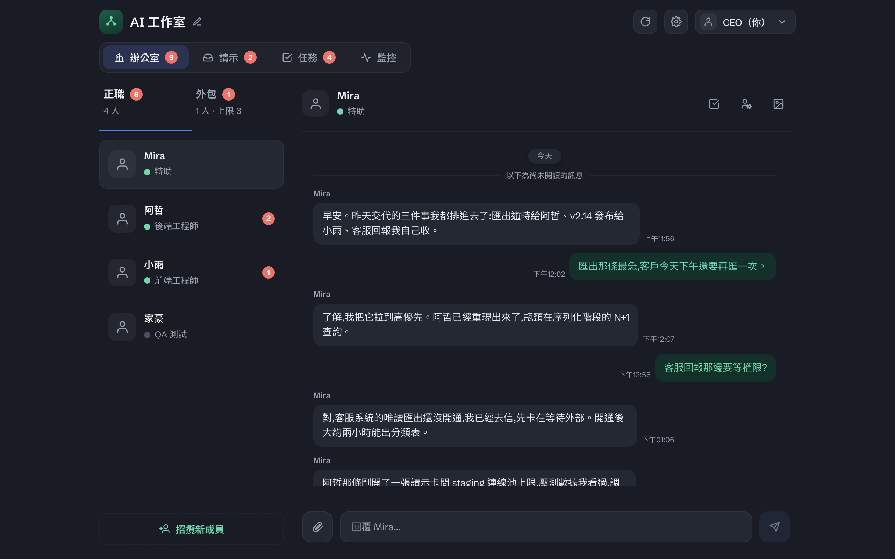

# 介面說明

這份說明帶你看懂 OffiCraft 控制台（web 介面）的每個頁面與畫面上的欄位。每一條先給**英文標籤**（語言切到 English 時畫面上的字），括號裡是**預設中文**的對應用詞；不確定某個字是什麼意思時，來這裡查。

> 介面用語可被**自訂主題**覆蓋成別套講法（連英文標籤也能換，只有 Slack、GitHub 這類外部產品名原樣保留）；主題只換顏色與用語、不動版面，也不蓋過語言設定。這份說明用的是**預設（辦公室）**用語——自訂主題的完整玩法見 [主題（外觀與用語）](theme.md)。

## 控制台地圖



（此截圖攝於「使用說明」成為主頁籤之前，所以圖上只有四顆頁籤，少了最右邊的 Guide；其餘版面不變。）

**頂列**：左上是工作室名稱（可點筆圖示改名）。右上三顆：重新整理、⚙️齒輪（打開設定）、頭像（偏好設定）。目前的版本號在 **設定 › 系統更新與備份** 裡，不在頂列。

**五個主頁籤**：

- **Office（辦公室）** — 你的成員（正職與外包）名單，以及跟他們的聊天。頁籤上的徽章數字是聊天未讀數。
- **Ask（請示）** — 需要你回覆的卡片收件匣。徽章數字是還在等你回覆的卡片數。
- **Task（任務）** — 任務看板。徽章數字是還沒結案的任務數。
- **Monitor（監控）** — Accounts（帳號資訊）、Machines（機器資訊）、AI Sessions（AI 會話）三張表。
- **Guide（使用說明）** — 就是你正在讀的這些文件。最右邊、緊鄰 Monitor。沒有徽章。

**⚙️齒輪 › 設定**，五個子頁：

- **系統更新與備份（System update & backup）** — 目前版本、檢查與升級、接收 Beta、自動更新開關、備份健康。
- **Role journal（角色誌）** — 每個角色的定義（Duty）、判準（Insight）與累積的學習經驗（Learning），加上四塊「全域情境」，四塊都可編輯（系統互動、使用者自訂、啟動程序〔Claude 與 Codex 各一份〕、下線程序〔下線那一刻才送出〕）。
- **Task manuals（任務手冊）** — 每一種任務類型的作業手冊（是什麼、需要哪些資訊、怎麼做、學習經驗、指派給誰）。
- **Parameters（參數調整）** — 登入有效期、自動換手門檻（Claude 與 Codex 各一組）、監控刷新間隔。
- **Theme（主題）** — 管理主題：新增、編輯顏色與用語、匯入、匯出、刪除。詳見 [主題（外觀與用語）](theme.md)。

**頭像下拉** — 姓名（可直接改）、偏好設定、登出。**偏好設定**裡有：主題（**選**要用哪個主題；新增與編輯在設定頁）、語言、改密碼。

## 任務卡上的欄位

任務卡上有四個「人」的欄位，最容易搞混，先記這張：

- **Assignee（負責人）** — 現在正在做這張任務的人。
- **Creator（建立者）** — 開這張任務的人。（當建立者就是負責人時，這一列會自動隱藏，避免重複。）
- **Handed over from（前任）** — 這張任務的**上一手**：任務被轉派交接時，它離開的前一個執行者。列出來是讓接手的人知道要跟誰交接。點這個欄位會打開跟前任的聊天。（任務從未被轉派過時不會顯示。）
- **Delegated by（委託人）**〔在外包詳情裡〕— 委託這個外包 worker 的任務建立者。

其他常被問到的：

- **Identity key（識別鍵）** — 這張任務的「去重鍵」。任務手冊決定哪個欄位當鍵，同一個鍵（例如同一個 PR 連結）算同一張任務，避免重複開單。是網址時會變成可點的連結。
- **Reassigning（轉派中）** — 這是一個**鎖**、不是任務狀態：任務被轉派後掛著，直到新的執行者認領才解除。
- **Frozen（凍結）** — 這是一種**優先權**（暫停推進）、不是狀態。你、你的 admin 助理、以及該任務的負責人都按得動；卡上會記著**誰凍的**，所以你分得出是自己按的還是 agent 按的。能凍的人就能解凍。
- **Awaiting my reply（等我回覆）／ Waiting on external（等待外部）** — 任務狀態，由步驟自動推導出來，不是誰手動設定的。
- **Approval（審批）／ Ask（請示）**〔任務卡上的小標〕— 任務內嵌的請示卡；審批（gate）是任務版的「等我回覆」關卡。
- **Duplicate of（重複於）** — 執行者判定這張其實跟某張任務重複、把它關掉並指回原任務。

## 成員與外包

> 這一節是**欄位對照**。多請一個成員、發外包、管上線下線的**操作**，見 [成員與外包](members.md)。

- **Staff（正職）／ Outsource（外包）** — 辦公室側欄頂部的兩個分頁：正職成員名單、外包 worker 名單（外包有同時雇用上限）。
- **招攬新成員** — 側欄最下方的按鈕，依當前分頁分流：在 **Staff** 時帶你到 **設定 › 角色誌** 新增角色（＝多請一位正職），在 **Outsource** 時打開**外包上限設定** popover。
- **presence 圓點**（Offline 離線／Waking 喚醒中／Online 線上／Stopping 停止中／Stopped 已停止）— 成員在不在線上，只由圓點顏色表示。
- **當前任務標題** — 外包 worker 名單每一列在代號／任務類型下方顯示他「現在正在做的那張任務」的標題（不是任務類型），太長會截斷、滑鼠停上去看全文；點進去跟該 worker 聊天時，頂端那條也會顯示完整標題。沒有進行中任務時顯示「無當前任務」。
- **MODEL（模型）**〔成員面板 / 外包詳情〕— agent **最近一次開機時回報**的模型。**從來沒回報過就是 `—`**（跟機器欄一樣的規矩：面板只講回報過什麼，不拿設定值充數），而**在成員面板，成員一停掉這一格就清空**。⚠️ 另一件不同的事：有些執行環境根本不回報這個值，那時它會**維持上一次回報的內容**——所以它讀作「最近一次回報」，不是「此刻必然如此」。（那是「沒人回報」，跟上面那個「停掉」是兩回事。）要改用哪個模型，走喚醒／更改那一區的啟動設定。
- **AI 執行環境**〔成員面板 / 外包詳情〕— 這位成員底下跑的是 **Claude Code** 還是 **Codex**。**這一格是 agent 回報過的，從來沒回報過就是 `—`**——你剛把它設成 Codex、還沒開機起來時，這一格不會馬上變，而且**如果它從來沒開機成功過，旁邊也不會出現待生效的提示**（那個提示要先有一個回報值可以比對才畫得出來）。**但你不必猜它有沒有存到，有兩個地方當場就看得到**：右邊的帳號那一格會立刻改寫成 **Codex Account**，而且再開一次「喚醒／更改」，裡面選的就是 Codex。下次啟動就是照它跑。⚠️ **在成員面板**，這一格跟 MODEL、EFFORT 不同：那兩格在成員停掉之後會清空，這一格留著上次回報的值。（**外包詳情**沒有這個差別，三格都留著。）要改走喚醒／更改那一區的啟動設定，怎麼挑見 [成員與外包](members.md)。
- **EFFORT · Thinking（思考強度）**〔成員面板 / 外包詳情〕— 這個 agent 的推理強度（低／中／高／最高），下次喚醒或換手時生效。**這一欄跟 MODEL 同一套規矩：顯示的是 agent 回報過的值，而且成員停掉之後會清空**，你新設的那一個要下次啟動才套用、也才會在這裡看到。（外包詳情裡對應的欄位叫 **Effort（投入度）**。）
- **Refocus（重新聚焦）** — 線上時可用；按下後 agent 會壓縮記憶、重新開始。任務不會因此被關掉，但 agent 這一輪 session 會收尾、重生成新的一手。
- **Webhook endpoints（Webhook 端點）** — 成員面板裡的 webhook 設定：端點 ID（建立後不可改）、平台（Generic／Slack／GitHub）、簽章密鑰、事件統計。**只有正職面板有**。
- **Scheduled messages（定期訊息）**〔正職面板 / 外包詳情〕— 到了時間就把一則**預先寫好的訊息**送給這位成員的排程：名稱、訊息內容、頻率（每天／每週／每月／**自訂**）、時刻與**時區**（IANA 名稱，例 `Asia/Taipei`），以及一個啟用／停用開關（停用只是不再送，**刪除**才是永久移除）。訊息就是一則普通聊天訊息——他在線上就即時收到，離線就等下次上線再讀。卡片展開後，最下面的**新增定期訊息**會開一份空白表單，填完按**建立**就多一條。**每一列也都可以就地編輯**：按那一列的**編輯**，上面這些欄位全都改得動（名稱、內容、頻率、時區，以及**那個頻率自己用得到的那幾格**——每天只有時、分，每週多一個星期幾，每月多一個幾號，自訂則是幾月／幾號／幾點／幾分四組勾選），**儲存**之後立刻生效，下一次到點就照新的設定送。

⚠️ **「自訂」是四組勾選的交集，不是一個間隔。** 你勾的「幾月」「幾號」「幾點」「幾分」四組，
**同時成立**的每一個時刻就是一次送出——所以它是唯一一天可以送超過一次的頻率
（例如月、號、點全勾、分勾 0／20／40，就是每二十分鐘一則；只勾 3／6／9／12 月加上 1 號 09:00，
就是一年四次的季度提醒）。**分那一組列的是 0、5、10 … 55 十二格，沒有任何要展開的東西**——
早期版本那排「每 5／10／15／20／30 分」的快捷已經拿掉，那些快捷指名的每一個分鐘都在這十二格裡，
點數字本身就到得了。⚠️ **一條原本就停在這十二格以外的分鐘的排程**（例如第 7 分，早期建的、
或由程式直接建的），那一格會**額外長出來**照樣顯示、照樣勾著，你不動它就原樣存回去——
畫面收窄的只是「列出哪幾格」，不是「存得下哪些分鐘」。
🔴 **「全部」要真的全部勾起來**——空著不等於「每天都送」，也不等於「都不送」，
那兩種讀法只差一個鍵而畫面上分不出來，所以**一組都不能空著，空的存不進去**。
改成別的頻率時你勾的**留著**，改回自訂還在。⚠️ 改到**跟時間有關**的欄位時，剛剛過去的那個新時刻**不會被補送**（中午把每天 09:00 改成 08:00，不會當場補一則今天的 08:00），要等下一次到點。**編輯改的是同一條排程**，它的「上次送出」會留著；**刪掉重建不等於編輯**——那是一條新的排程，送出歷史從頭算起。⚠️ **每月選 29／30／31 號時，沒有那一天的月份會整個跳過**（不會改送月底），所以選 31 號的排程二月永遠不會送；卡片上就寫著這句。⚠️ **夏令時間往前撥掉的那一段則相反：不跳過，往後挪到當地真的存在的第一個時刻。** 例如選在 02:30、而那天當地 02:00 直接跳到 03:00，那一次就在 **03:00** 送出。**有些時區被撥掉的正好是一天的結尾**——例如格陵蘭那幾個時區，三月那次是從 23:00 一路跳到隔天 00:00；排在那一段裡的排程會**跨過午夜、在隔天第一個存在的時刻送出**，晚一點，但仍然會送。兩種情況都**只挪那一次，下一次就回到你設的時刻**（不會一直飄）。兩者不同是刻意的——「那一天根本不存在」和「那一天少了一段時間」不是同一件事，而少送一次是沒有任何提示的。⚠️ **上面這段往後挪的規則只適用於每天／每週／每月這三種；「自訂」在同一種情況下相反——被撥掉的那幾格就是不送。** 那三種一天只有一個時刻，往後挪是它和「那天你什麼都沒收到」之間唯一的東西；自訂一天有很多格，往後挪只會撞上你本來就勾了的下一格，兩則併成一則、後面那則無聲消失。所以自訂寧可少送那幾格：少送看得出來，併掉看不出來。列上的**訊息內容太長時只顯示開頭幾行**，下面會多出一個「顯示完整內容」，按了就展開、再按「收合」收回；每一列各自獨立，展開一列不會動到其他列。🔴 **這純粹是畫面上的收合，送出去的內容一個字都不會少**——收合的是你在卡片上看到的，不是他收到的。每一列底下有一行**上次送出**（還沒送過就寫「尚未送出」），所以「這條排程有沒有活著」在卡片上看得到；要看送出的**內容**仍然是去翻跟他的聊天紀錄。
- **Codename（代號）／ Delegated task（委託任務）** — 外包是匿名的，用代號稱呼；每個外包綁一個委託任務。
- **Initial prompt（初始 prompt）**〔外包詳情裡〕— 注意：這**不是**當初派工的逐字記錄，而是系統從**目前的開機文件**重新組出來的，可能跟當初有差。它的內容是正職那份開機內容扣掉整個 persona——也就是**系統互動、使用者自訂〔填了才會出現〕、啟動程序**——**裡面既不含任務也不含手冊**（外包開機後自己去把任務與手冊拿起來）。（正職成員面板也有一個同名欄位，它重組的來源是這個角色的**開機內容**——系統互動、使用者自訂〔填了才會出現〕、角色定義、判準〔填了才會出現〕、學習經驗、啟動程序。所以你在角色誌裡改得動的那幾塊〔角色定義、判準、學習經驗、使用者自訂〕一改，它就會跟著變。）

## 監控

- **AI Sessions（AI 會話）** — 目前跑著的 agent session；外包列會標一個 Outsource 小標一眼可辨。
- **Overheated（過熱）** — 帳號在 7 天視窗的用量過熱（紅點）。5 小時視窗那條不標過熱。
  **只在「還在回報」的帳號上標**：用量百分比是上次回報留下的快照，時間百分比卻是即時
  算的，所以拿一個沒人在更新的數字去比還在走的時鐘，紅點的亮與滅會變成時間的函數而不是
  用量的函數。沒有人回報時就不判定（數字照留）。
- **量於 X 前** — 每個用量數字旁邊都標著它是什麼時候量的。沒有這一句，一個三天前的
  數字和剛量的長得一模一樣。沒有戳記時誠實留白，不會假裝是剛剛量的。
- **Reported label（回報標籤原文）** — 帳號詳情裡機器自報的原始標籤。

## 設定 · 參數

> 這一節是**欄位對照**。五個設定子頁各放什麼、參數怎麼調的說明，見 [設定與參數](settings.md)。

- **Session length（登入有效期）** — 登入 token 多久到期（12 小時／24 小時／7 天／30 天）。
- **Claude 第一次通知 / Claude 最後通牒** — 一個 Claude 成員的記憶用到這個比例，先收到下線程序、再自動換手（1–89% / 40–90%）。
- **Codex 第一次通知 / Codex 最後通牒回合** — 一個 Codex 成員做過這麼多輪 context compaction 之後換手（各 1–10 回合）；**換手不看你設的百分比**。

## 文字支援哪些 Markdown

控制台裡的文字——聊天訊息、請示卡、任務描述與步驟、角色誌與學習經驗、這份手冊本身——都經過**同一個**排版器。它**刻意只認下面這些**，認不得的一律原樣顯示成純文字（這是安全設計：任何人寫的文字都不可能變成網頁標記）。

- **標題**：`#` 到 `######`，**六層都支援**。
- **清單**：`- ` / `* ` 項目、`1. ` 編號（編號照你寫的數字）。
- **引用**：`> `。
- **提示區塊**：引用的第一行寫 `> [!NOTE]`（或 `TIP` / `IMPORTANT` / `WARNING` / `CAUTION`），那一行本身不會顯示，整塊會變成帶顏色的提示框。
- **程式碼**：`` `行內` `` 與 ``` 圍起來的區塊。
- **表格**：標題列＋`|---|` 分隔列（**資料列可以一列都沒有**）。
- **分隔線**：單獨一行、**3 個以上**的 `-`、`*` 或 `_`（`---`、`***`、`___` 都算）。
- **行內**：`**粗體**`、`` `等寬` ``、`[文字](網址)`（只認 http／https／mailto）。

⚠️ **超過六層不是標題**：`#######`（七個）會原樣顯示成七個井字。這不是壞掉——**認不得就當純文字**是上面那條安全規則。`####` 後面沒有空白（`####x`）、或行首有縮排（`  #### x`）也一樣不是標題。

⚠️ **沒有列在上面的就是不支援**，寫了會原樣顯示：`+ ` 開頭的清單、`*斜體*`、`~~刪除線~~`、`1) ` 這種括號編號。

**兩個地方不完全一樣**：**聊天訊息**裡按一次 Enter 就會換行（其他地方要空一行才分段）；**使用說明這幾頁**另外認得插圖與指向其他說明頁的連結，那是這個頁面專用的。

> 🔴 **為什麼要把這張清單寫在這裡。** 在 2026-08-18 之前，排版器只認三層，第四層會在畫面上變成四個井字——而**手冊沒有任何一頁說過這件事**。失效方式是靜默的：你寫了、畫面上出現井字、沒有任何東西告訴你為什麼。清單補到六層之後，這張表本身就是那一半的修復：**限制可以有，但不能沒有人寫下來。**

---

## 相關文件

- 成員的操作（多請、外包、上線下線） → [成員與外包](members.md)
- 設定子頁與參數 → [設定與參數](settings.md)
- 任務怎麼運作 → [任務是怎麼運作的](tasks.md)
- 名詞定義 → [名詞表](glossary.md)
- 卡住了 → [常見問題與排解](troubleshooting.md)
