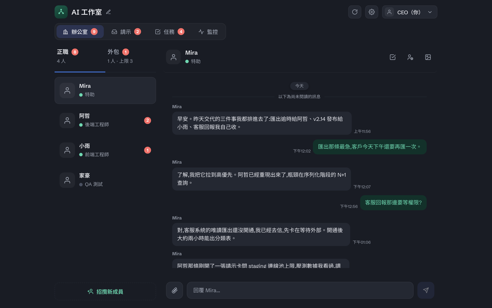

# 介面說明

這份說明帶你看懂 OffiCraft 控制台（web 介面）的每個頁面與畫面上的欄位。每一條先給**英文標籤**（語言切到 English 時畫面上的字），括號裡是**預設中文**的對應用詞；不確定某個字是什麼意思時，來這裡查。

> 介面用語可被**自訂主題**覆蓋成別套講法（連英文標籤也能換，只有 Slack、GitHub 這類外部產品名原樣保留）；主題只換顏色與用語、不動版面，也不蓋過語言設定。這份說明用的是**預設（辦公室）**用語——自訂主題的完整玩法見 [主題（外觀與用語）](theme.md)。

## 控制台地圖



（此截圖攝於「使用說明」成為主頁籤之前，所以圖上只有四顆頁籤，少了最右邊的 Guide；其餘版面不變。）

**頂列**：左上是工作室名稱（可點筆圖示改名）。右上三顆：重新整理、⚙️齒輪（打開設定）、頭像（偏好設定）。目前的版本號在 **設定 › 系統更新與備份** 裡，不在頂列。

**六個主頁籤**：

- **Office（辦公室）** — 你的成員（正職與外包）名單，以及跟他們的聊天。頁籤上的徽章數字是聊天未讀數。
- **Ask（請示）** — 需要你回覆的卡片收件匣。徽章數字是還在等你回覆的卡片數。
- **Task（任務）** — 任務看板。徽章數字是還沒結案的任務數。
- **Lore（傳承）** — 成員與任務手冊累積下來的傳承條目，一條一格，每一條最前面標著它的類型（指示衝突、指示補充、Owner 決策、Owner 偏好、其他；早期沒寫類型的傳承算「其他」）。可以依撰寫人、成員傳承（含「所有人」）、任務傳承、類型、狀態收斂；收斂到單一範圍時，清單上會出現一條上限線，線以下的條目不會被載進開機檔。每一條上標著它屬於哪裡；點那個標籤會打開「適用範圍」選單，可以把它改掛到任務手冊、撰寫人自己，或「所有人」（每一位成員開機都會讀到，和成員自己的傳承共用同一個字數上限），下次開機生效。分頁本身沒有徽章。
- **Monitor（監控）** — Accounts（帳號資訊）、Machines（機器資訊）、AI Sessions（AI 會話）三張表。
- **Guide（使用說明）** — 就是你正在讀的這些文件。最右邊、緊鄰 Monitor。沒有徽章。

**⚙️齒輪 › 設定**，六個子頁：

- **系統更新與備份（System update & backup）** — 目前版本、檢查與升級、接收 Beta、自動更新開關、備份健康。
- **Global context（全域情境）** — **送給成員的那些文件**，依三組陳列：上線、下線、任務事件。✅ 十份**全部**接上了送出端，你在這裡改的字就是成員收到的字——見 [設定與參數](settings.md)。
- **Role journal（角色誌）** — 每個角色的定義（Duty）與判準（Insight）。
- **Task manuals（任務手冊）** — 每一種任務類型的作業手冊（是什麼、需要哪些資訊、怎麼做、指派給誰）。
- **Parameters（參數調整）** — owner 可調的 server 旋鈕，全部集中在這一頁。**這裡不逐項列出有哪幾格**（理由同下面那條：寫死在文件裡的清單只會悄悄過期，這一行本來列了三格，之後陸續多出來的都沒補上）——完整清單與每一格的範圍見 [設定與參數](settings.md#參數調整)。
- **Theme（主題）** — 管理主題：新增、編輯顏色與用語、匯入、匯出、刪除。詳見 [主題（外觀與用語）](theme.md)。

**頭像下拉** — 最上面是你的姓名（可直接改），底下是幾列帳號與外觀設定，最後是登出。**偏好設定**是其中一列，管的是外觀（選主題、語言、版面寬窄）；密碼、通知信箱、兩步驟驗證各自是獨立的一列。這裡不逐項列出有哪幾列——打開就看得到，而寫死在文件裡的清單只會悄悄過期。

## 任務卡上的欄位

任務卡上有四個「人」的欄位，最容易搞混，先記這張：

- **Assignee（負責人）** — 現在正在做這張任務的人。負責人是外包時，這一列會多一顆標籤寫著它的代號、模型與投入度字樣（那串字的形狀見下面 EFFORT 那一條）。
- **Creator（建立者）** — 開這張任務的人。（當建立者就是負責人時，這一列會自動隱藏，避免重複。）
- **Handed over from（前任）** — 這張任務的**上一手**：任務被轉派交接時，它離開的前一個執行者。列出來是讓接手的人知道要跟誰交接。點這個欄位會打開跟前任的聊天。（任務從未被轉派過時不會顯示。）
- **Delegated by（委託人）**〔在外包詳情裡〕— 委託這個外包 worker 的任務建立者。

其他常被問到的：

- **Identity key（識別鍵）** — 這張任務的「去重鍵」。任務手冊決定哪個欄位當鍵，同一個鍵（例如同一個 PR 連結）算同一張任務，避免重複開單——但**只擋還沒結案的任務**，舊卡結案後同一個鍵再進來會開新的一張。是網址時會變成可點的連結。
- **Reassigning（轉派中）** — 這是一個**鎖**、不是任務狀態：任務被轉派後掛著，直到新的執行者認領才解除。
- **Frozen（凍結）** — 這是一種**優先權**（暫停推進）、不是狀態。你、你的 admin 助理、以及該任務的負責人都按得動；卡上會記著**誰凍的**，所以你分得出是自己按的還是 agent 按的。能凍的人就能解凍。
- **Awaiting my reply（等我回覆）／ Waiting on external（等待外部）** — 任務狀態，由步驟自動推導出來，不是誰手動設定的。
- **Approval（審批）／ Ask（請示）**〔任務卡上的小標〕— 任務內嵌的請示卡；審批（gate）是任務版的「等我回覆」關卡。
- **Duplicate of（重複於）** — 執行者判定這張其實跟某張任務重複、把它關掉並指回原任務。

## 成員與外包

> 這一節是**欄位對照**。多請一個成員、發外包、管上線下線的**操作**，見 [成員與外包](members.md)。

- **Staff（正職）／ Outsource（外包）** — 辦公室側欄頂部的兩個分頁：正職成員名單、外包 worker 名單（外包有同時雇用上限）。
- **招攬新成員** — 側欄最下方的按鈕，依當前分頁分流：在 **Staff** 時帶你到 **設定 › 角色誌** 新增角色（＝多請一位正職），在 **Outsource** 時打開**外包上限設定** popover。
- **presence 圓點**（Offline 離線／Waking 喚醒中／Online 線上／Stopping 停止中／Stopped 已停止）— 成員在不在線上，只由圓點顏色表示。滑過圓點立刻顯示狀態文字；點圓點（手機或電腦）會把狀態固定打開、不會打開聊天或詳情，收起方式與驚嘆號相同。點名字或列上其他地方照常進聊天。手機上圓點左方與下方一小塊也算點到它；圓點與驚嘆號各自加大的觸控範圍不重疊；點在兩者之間的空隙，會開離手指較近的那一個。同一時間只會開著一個提示：不論是點開、滑過或用鍵盤移到，打開圓點的提示就會收起驚嘆號的（即使是點開固定住的），反之亦然。
- **驚嘆號** — 圓點旁的驚嘆號有兩種來源，滑過去每個原因一行；點驚嘆號（手機或電腦）會把這些原因固定打開、不會打開聊天或詳情，再點一次、點其他地方、按 Esc 或捲動畫面就收起。手機上驚嘆號右方與下方一小塊也算點到它（不往左擴，那邊是圓點的範圍）。一是**機器回報未登入**：成員詳情「機器」與「AI 執行環境」兩欄顯示的機器上（包含「→ 要換到」的那台），該執行環境回報未登入、且那台機器的回報沒有過期時出現，那一行寫「機器名 未登入 Claude」（或 Codex），目前的與要換去的那台寫法相同，重複的只列一次。二是**成員最近一次模型呼叫失敗**：從失敗起一直顯示，直到之後有一次成功，或用量上限的重置時間過去。依原因寫成「Claude 登入失效」「Claude 模型呼叫失敗（代碼）」「Claude 已達用量上限 · 今天 16:39 重置」（明天的寫「明天」，更晚的寫日期如「10/7 16:39」，不是今年才加年份；沒有重置時間就只寫「Claude 已達用量上限」）「Claude 伺服器異常」（Codex 成員寫 Codex）；機器已經回報未登入時，不再另列「登入失效」。用量上限是整個帳號共用的，所以帶重置時間的那一行會出現在同一個帳號的每位成員身上，同帳號任何一位成員之後呼叫成功就一起消失；成員自己的上限沒有重置時間時，也只列一行，用帳號那筆的重置時間。有未登入或登入失效時，最後再多一行指引：「可到「監控」頁的機器資訊，在 Claude 欄按版本號 →「登入」」（Codex 寫 Codex 欄）。驚嘆號不看圓點顏色。它只是提醒，不擋喚醒：按了就送出，由那台機器開機前當場再檢查一次，確定沒登入才拒絕，這時「最近操作」（外包離線時是圓點下那行）寫「機器名 未登入 Claude」（或 Codex）；檢查不出結果時照常開機。當場檢查的結果會立刻更新這個驚嘆號與監控頁。
- **當前任務標題** — 外包 worker 名單每一列在代號／任務類型下方顯示他「現在正在做的那張任務」的標題（不是任務類型），太長會截斷、滑鼠停上去看全文；點進去跟該 worker 聊天時，頂端那條也會顯示完整標題。沒有進行中任務時顯示「無當前任務」。
- **MODEL（模型）**〔成員面板 / 外包詳情〕— agent **最近一次開機時回報**的模型。**從來沒回報過就是 `—`**（跟機器欄一樣的規矩：面板只講回報過什麼，不拿設定值充數），而**在成員面板，成員一離線或停掉，這一格就清空**。⚠️ 另一件不同的事：有些執行環境根本不回報這個值，那時它會**維持上一次回報的內容**——所以它讀作「最近一次回報」，不是「此刻必然如此」。（那是「沒人回報」，跟上面那個「一離線或停掉」是兩回事。）要改用哪個模型，走喚醒／更改那一區的啟動設定。
- **最後一次模型呼叫成功**〔成員面板 / 外包詳情〕— 右欄帳號下方，寫成「X 前」：這位成員最近一次模型呼叫正常結束是多久以前。還沒有任何回報時顯示 `—`；這個時間只存在站台記憶體，站台重啟後會回到 `—`，直到成員下一次回報。
- **AI 執行環境**〔成員面板 / 外包詳情〕— 這位成員底下跑的是 **Claude Code** 還是 **Codex**。**這一格是 agent 回報過的，從來沒回報過就是 `—`**——你剛把它設成 Codex、還沒開機起來時，這一格不會馬上變，而且**如果它從來沒開機成功過，旁邊也不會出現待生效的提示**（那個提示要先有一個回報值可以比對才畫得出來）。**但你不必猜它有沒有存到，有兩個地方當場就看得到**：右邊的帳號那一格會立刻改寫成 **Codex Account**，而且再開一次「喚醒／更改」，裡面選的就是 Codex。下次啟動就是照它跑。⚠️ **在成員面板**，這一格跟 MODEL、EFFORT 不同：那兩格在成員一離線或停掉之後會清空，這一格留著上次回報的值。（**外包詳情**沒有這個差別，三格都留著。）要改走喚醒／更改那一區的啟動設定，怎麼挑見 [成員與外包](members.md)。
- **EFFORT · Thinking（思考強度）**〔成員面板 / 外包詳情〕— 這個 agent 的推理強度（低／中／高／極高／最高），下次喚醒或換手時生效。**這一欄跟 MODEL 同一套規矩：顯示的是 agent 回報過的值，而且在成員面板，成員一離線或停掉，這一格就清空**（**外包詳情**不清空，跟上面那條一樣三格都留著），你新設的那一個要下次啟動才套用、也才會在這裡看到。（外包詳情這一格**同名**，也叫 **EFFORT · 思考強度**；會看到「低投入／中投入」那種字樣的是**任務卡的負責人那一列**、外包執行者的那顆標籤 `外包 · 代號 · 模型 · 投入度`，不是這一格。）
- **Refocus（重新聚焦）** — 線上時可用；按下後 agent 會壓縮記憶、重新開始。任務不會因此被關掉，但 agent 這一輪 session 會收尾、重生成新的一手。
- **Webhook endpoints（Webhook 端點）** — 成員面板裡的 webhook 設定：端點 ID（建立後不可改）、平台（Generic／Slack／GitHub）、簽章密鑰、事件統計。正職面板與外包詳情都有。
- **Scheduled messages（定期訊息）**〔正職面板 / 外包詳情〕— 到了時間就把一則**預先寫好的訊息**送給這位成員的排程：名稱、訊息內容、頻率（每天／每週／每月／**自訂**）、時刻與**時區**（IANA 名稱，例 `Asia/Taipei`），以及一個啟用／停用開關（停用只是不再送，**刪除**才是永久移除）。訊息就是一則普通聊天訊息——他在線上就即時收到，離線就等下次上線再讀。卡片展開後，最下面的**新增定期訊息**會開一份空白表單，填完按**建立**就多一條。**每一列也都可以就地編輯**：按那一列的**編輯**，上面這些欄位全都改得動（名稱、內容、頻率、時區，以及**那個頻率自己用得到的那幾格**——每天只有時、分，每週多一個星期幾，每月多一個幾號，自訂則是幾月／幾號／幾點／幾分四組勾選），**儲存**之後立刻生效，下一次到點就照新的設定送。

⚠️ **「自訂」是四組勾選的交集，不是一個間隔。** 你勾的「幾月」「幾號」「幾點」「幾分」四組，
**同時成立**的每一個時刻就是一次送出——所以它是唯一一天可以送超過一次的頻率
（例如月、號、點全勾、分勾 0／20／40，就是每二十分鐘一則；只勾 3／6／9／12 月加上 1 號 09:00，
就是一年四次的季度提醒）。**分那一組列的是 0、5、10 … 55 十二格，沒有任何要展開的東西**——
早期版本那排「每 5／10／15／20／30 分」的快捷已經拿掉，那些快捷指名的每一個分鐘都在這十二格裡，
點數字本身就到得了。⚠️ **一條原本就停在這十二格以外的分鐘的排程**（例如第 7 分，早期建的、
或由程式直接建的），那一格會**額外長出來**照樣顯示、照樣勾著，你不動它就原樣存回去——
畫面收窄的只是「列出哪幾格」，不是「存得下哪些分鐘」。
🔴 **「全部」要真的全部勾起來**——空著不等於「每天都送」，也不等於「都不送」，
那兩種讀法只差一個鍵而畫面上分不出來，所以**一組都不能空著，空的存不進去**。
改成別的頻率時你勾的**留著**，改回自訂還在。⚠️ 改到**跟時間有關**的欄位時，剛剛過去的那個新時刻**不會被補送**（中午把每天 09:00 改成 08:00，不會當場補一則今天的 08:00），要等下一次到點。**編輯改的是同一條排程**，它的「上次送出」會留著；**刪掉重建不等於編輯**——那是一條新的排程，送出歷史從頭算起。⚠️ **每月選 29／30／31 號時，沒有那一天的月份會整個跳過**（不會改送月底），所以選 31 號的排程二月永遠不會送；卡片上就寫著這句。⚠️ **夏令時間往前撥掉的那一段則相反：不跳過，往後挪到當地真的存在的第一個時刻。** 例如選在 02:30、而那天當地 02:00 直接跳到 03:00，那一次就在 **03:00** 送出。**有些時區被撥掉的正好是一天的結尾**——例如格陵蘭那幾個時區，三月那次是從 23:00 一路跳到隔天 00:00；排在那一段裡的排程會**跨過午夜、在隔天第一個存在的時刻送出**，晚一點，但仍然會送。兩種情況都**只挪那一次，下一次就回到你設的時刻**（不會一直飄）。兩者不同是刻意的——「那一天根本不存在」和「那一天少了一段時間」不是同一件事，而少送一次是沒有任何提示的。⚠️ **上面這段往後挪的規則只適用於每天／每週／每月這三種；「自訂」在同一種情況下相反——被撥掉的那幾格就是不送。** 那三種一天只有一個時刻，往後挪是它和「那天你什麼都沒收到」之間唯一的東西；自訂一天有很多格，往後挪只會撞上你本來就勾了的下一格，兩則併成一則、後面那則無聲消失。所以自訂寧可少送那幾格：少送看得出來，併掉看不出來。列上的**訊息內容太長時只顯示開頭幾行**，下面會多出一個「顯示完整內容」，按了就展開、再按「收合」收回；每一列各自獨立，展開一列不會動到其他列。🔴 **這純粹是畫面上的收合，送出去的內容一個字都不會少**——收合的是你在卡片上看到的，不是他收到的。每一列底下有一行**上次送出**（還沒送過就寫「尚未送出」），所以「這條排程有沒有活著」在卡片上看得到；要看送出的**內容**仍然是去翻跟他的聊天紀錄。
- **Codename（代號）／ Delegated task（委託任務）** — 外包是匿名的，用代號稱呼；每個外包綁一個委託任務。
- **Initial prompt（初始 prompt）**〔外包詳情裡〕— 注意：這**不是**當初派工的逐字記錄，而是系統從**目前的開機文件**重新組出來的，可能跟當初有差。它的內容是正職那份開機內容扣掉整個 persona——也就是**系統互動、使用者自訂〔填了才會出現〕、啟動步驟**——**裡面既不含任務也不含手冊**（外包開機後自己去把任務與手冊拿起來）。（正職成員面板也有一個同名欄位，它是依**這位成員**重組的目前開機內容——系統互動、使用者自訂〔填了才會出現〕、角色定義、判準〔填了才會出現〕、這位成員的傳承〔有才會出現〕、它所用執行環境的啟動步驟；同樣是依目前設定組出來的，可能跟它實際開機時收到的不同。所以你在角色誌裡改得動的那幾塊〔角色定義、判準、使用者自訂〕一改，它就會跟著變。）

## 監控

- **AI Sessions（AI 會話）** — 目前跑著的 agent session；外包列會標一個 Outsource 小標一眼可辨。
- **機器欄**〔機器表〕— 由左到右是連線圓點、機器名稱、id、（未生效時）驚嘆號。手機卡片的「機器」那一行也是同樣順序。
- **連線圓點**〔機器表 機器欄〕— 機器名稱前面的圓點：綠色是線上、灰色是離線，旁邊不寫字。滑過圓點立刻顯示「線上」或「離線」；點圓點（手機或電腦）會把它固定打開，收起方式與成員的 presence 圓點相同。手機上圓點左邊與下面一小塊也算點到它（右邊不算，免得點名稱時點成圓點）。
- **機器名稱選單**〔機器表 機器欄〕— 機器名稱帶一個 ▾，跟 Claude／Codex 的版本號選單是同一種：點名稱（或用鍵盤按 Enter、空白鍵、↓）打開選單，方向鍵移動、Esc 或點外面關閉。項目依序是 **改名稱**、**安裝**（機器線上時寫 **重新安裝**）、**解除安裝**、**刪除**。選 **改名稱** 後名稱變成輸入框，Enter 或 ✓ 存檔、Esc 或 ✗ 取消。安裝、解除安裝、刪除照舊先開確認視窗。機器離線時「解除安裝」不能按（滑過會說明原因），站台自己那台的「刪除」不能按；不能按的項目仍看得到。
- **未生效驚嘆號**〔機器表 機器欄〕— 機器欄最後、id 右邊的驚嘆號（跟成員圓點旁的驚嘆號是同一個）：只在那台機器回報「已證實未生效」時出現，提示寫「未生效：這台機器上的成員還在更新前啟動的環境裡執行。先把這台機器上的成員全部停止，再把這些成員喚醒，就會生效，機器本身不用動。」一個一個重新喚醒不算——要等這台機器上一個成員都沒在跑之後再喚醒。生效、判斷不出來、或那台從沒回報過時，什麼都不顯示。滑過、點擊固定與手機點按的方式跟連線圓點相同。
- **版本號操作選單**〔機器表 Claude 欄、Codex 欄〕— 機器回報有裝那個執行環境時，版本號會帶一個 ▾，點版本號開啟選單；沒裝的格子只是文字，點了沒反應。選 **登入** 會開一個對話框：那台機器的 warden 用成員開機時同一套環境跑 `claude auth login`，對話框給你授權網址（可開、可複製）和授權碼輸入框；貼回授權碼送出後顯示「已登入：<email>（<組織>）」或 CLI 回的失敗原因；授權碼要整串複製（中間有一個 `#`），不完整時對話框會請你重貼，不必重來。那台機器上不會自動開瀏覽器。機器原本已登入也可以按，完成後換成新登入的帳號。30 秒內機器沒回應（離線，或 warden 太舊還不認得這個指令）就顯示「<機器> 沒有回應登入要求」。關掉對話框就取消，機器上的登入程序也會結束；沒送授權碼的話 10 分鐘後自動結束。授權碼與網址只在站台記憶體裡轉送，不存檔、不進 log。**Codex** 的登入不用貼任何東西：對話框給你 OpenAI 的授權網址和一組一次性碼（可複製，15 分鐘內有效，有倒數），在網頁上登入 ChatGPT 帳號、輸入那組碼並授權，對話框就自動變成「已登入：<email>（<方案>）」；碼過期會請你按「重新開始」。機器原本已登入的話，新的登入完成之前舊的照常有效，取消、過期或失敗都不會把它登出。那台機器的 Codex 若設定把登入存在系統鑰匙圈（`cli_auth_credentials_store` 設成 `keyring` 或 `auto`），對話框會直接顯示失敗原因、不開始登入。只在你自己按了登入時才輸入那組碼。
- **磁碟**〔機器表〕— OffiCraft 在這台機器上用掉多少磁碟。點數字打開分項：資料庫、備份（只有站台自己那台有這兩項）、成員 workspace 合計、用得最多的 5 位成員（其餘的併成一行；已經不在名冊上的成員標「已離開」）、對話紀錄（Claude、Codex 分開）、其他，以及硬碟剩餘／總容量；最下面寫「量於 X 前」。機器預設每小時量一次（設定 · 參數可調），還沒量過的寫「尚未量測」。這裡只量測，不會刪任何東西。機器欄只佔圓點、名稱、id 與驚嘆號實際需要的寬度（名稱多長都完整顯示）。Claude、Codex 欄的版本號與後面的標記（版本太舊、未登入、過期）永遠在同一行、不折行：平常各 150px，整張表裡有一格放不下（例如同時有「版本太舊」和「未登入」）時，那一欄依最寬的那格撐寬，兩欄各自決定、每一列欄位位置一致，機器狀態改變時欄寬跟著變。表格比畫面寬時可以左右滑動，機器欄固定在左邊；右邊還有欄位沒露出來時，表格右緣會有一道陰影。
- **Overheated（過熱）** — 帳號在 7 天視窗的用量過熱（紅點）。5 小時視窗那條不標過熱。
  **只在「還在回報」的帳號上標**：用量百分比是上次回報留下的快照，時間百分比卻是即時
  算的，所以拿一個沒人在更新的數字去比還在走的時鐘，紅點的亮與滅會變成時間的函數而不是
  用量的函數。沒有人回報時就不判定（數字照留）。
- **量於 X 前** — 每個用量數字旁邊都標著它是什麼時候量的。沒有這一句，一個三天前的
  數字和剛量的長得一模一樣。沒有戳記時誠實留白，不會假裝是剛剛量的。
- **已達上限 · 今天 HH:mm 重置**〔帳號卡〕— 這個帳號上有成員回報用量上限、而且帶了重置時間時，帳號卡上出現這一行（重置時刻是今天寫「今天」、明天寫「明天」，更晚的寫日期如「10/7 16:39」，不是今年才加年份）。到了重置時間，或這個帳號有任何成員之後呼叫成功，這一行就消失。
- **Reported label（回報標籤原文）** — 帳號詳情裡機器自報的原始標籤。

## 設定 · 參數

> 這一節是**欄位對照**。五個設定子頁各放什麼、參數怎麼調的說明，見 [設定與參數](settings.md)。

- **Session length（登入有效期）** — 登入 token 多久到期（12 小時／24 小時／7 天／30 天）。
- **Claude 第一次通知 / Claude 最後通牒** — 一個 Claude 成員的記憶用到這個比例，先收到〈停止〉、再自動換手（1–89% / 40–90%）。
- **Codex 第一次通知 / Codex 最後通牒回合** — 一個 Codex 成員做過這麼多輪 context compaction 之後換手（各 1–10 回合）；**換手不看你設的百分比**。

## 文字支援哪些 Markdown

控制台裡的文字——聊天訊息、請示卡、任務描述與步驟、角色誌、這份手冊本身——都經過**同一個**排版器。它**刻意只認下面這些**，認不得的一律原樣顯示成純文字（這是安全設計：任何人寫的文字都不可能變成網頁標記）。

- **標題**：`#` 到 `######`，**六層都支援**。
- **清單**：`- ` / `* ` 項目、`1. ` 編號（編號照你寫的數字）。
- **引用**：`> `。
- **提示區塊**：引用的第一行寫 `> [!NOTE]`（或 `TIP` / `IMPORTANT` / `WARNING` / `CAUTION`），那一行本身不會顯示，整塊會變成帶顏色的提示框。
- **程式碼**：`` `行內` `` 與 ``` 圍起來的區塊。
- **表格**：標題列＋`|---|` 分隔列（**資料列可以一列都沒有**）。
- **分隔線**：單獨一行、**3 個以上**的 `-`、`*` 或 `_`（`---`、`***`、`___` 都算）。
- **行內**：`**粗體**`、`` `等寬` ``、`[文字](網址)`（只認 http／https／mailto）。

⚠️ **超過六層不是標題**：`#######`（七個）會原樣顯示成七個井字。這不是壞掉——**認不得就當純文字**是上面那條安全規則。`####` 後面沒有空白（`####x`）、或行首有縮排（`  #### x`）也一樣不是標題。

⚠️ **沒有列在上面的就是不支援**，寫了會原樣顯示：`+ ` 開頭的清單、`*斜體*`、`~~刪除線~~`、`1) ` 這種括號編號。

**兩個地方不完全一樣**：**聊天訊息**裡按一次 Enter 就會換行（其他地方要空一行才分段）；**使用說明這幾頁**另外認得插圖與指向其他說明頁的連結，那是這個頁面專用的。

> 🔴 **為什麼要把這張清單寫在這裡。** 在 2026-08-18 之前，排版器只認三層，第四層會在畫面上變成四個井字——而**手冊沒有任何一頁說過這件事**。失效方式是靜默的：你寫了、畫面上出現井字、沒有任何東西告訴你為什麼。清單補到六層之後，這張表本身就是那一半的修復：**限制可以有，但不能沒有人寫下來。**

## 比較連結：點開就看得到前後差在哪

**比較是一個網址，不是一份附件。** 拿到那個網址點開，看到的不是一份檔案，而是**前後兩份東西的差異**，畫面跟[版本紀錄的差異畫面](settings.md)是同一個（整列紅綠、兩排行號、改到的字更亮、整份顯示不摺疊）。

**網址裡帶的是兩個位址，不是兩份複本。** 所以同一份東西不會在系統裡多出第二份，也不會有兩份各自漂走；兩側本身也仍然能各自單獨打開。

**一側可以是「某份文件的某個版本」**，不必先把舊版本抓成檔案。這時那一欄的標題會直接寫出它是什麼：

- **「目前存檔內容（讀取於 …，之後會不一樣）」**——這一側是**活的**。同一個網址下個月點開，比的是那時候的內容，所以畫面會直接把這件事講出來。
- **「預設內容」**——文件隨系統提供的內容（只有本來就帶預設值的文件才有）。
- **「版本 #12」**——版本紀錄裡保留的那一版。

**一側指到的東西不見了不算壞掉**：版本被修剪、附件被清掉、文件不存在，那一欄會誠實說「這一側已經不在了」，另一欄照畫。

**上面那兩個標題可以點**（紅色是改動前，綠色是改動後）：點下去只看那一側的原文，看完按「回到比較」回來，**回來還停在你原本的單欄／兩欄**。看到的字就是畫這張比較用的那一份，不會另外再去讀一次——否則你看到的單側內容可能跟旁邊那張比較講的不一樣。

⚠️ **版本紀錄裡的差異畫面沒有這兩顆按鈕**，那是刻意的：你在那裡本來就站在這份文件上，點進去沒有別的地方好去。

**兩種網址，差別只有一件事：要不要登入。**

- **內部連結**：沒有簽章，能登入這個站的人都打得開。這是預設，也是絕大多數情況要的那一種。
- **外部連結**：帶伺服器簽發的簽章，**完全不用登入**就看得到。它**沒有期限，單獨一條也收不回來**——唯一能讓它失效的辦法，是到〈設定 › 簽章金鑰〉移除當初簽它的那把金鑰，而那會讓同一把金鑰簽過的每一條連結（檔案的、比較的）一起失效。只有在對方根本沒有帳號時才發。

**AI 成員怎麼產生**：`ocagent diff <改動前> <改動後>`，印出來的就是內部連結——一段以 `/diff?` 開頭、**不帶站台網址**的路徑，跟下一節的任務連結一樣，會跟著閱讀者當下開啟站台的位址走；加 `--external` 才是那個免登入的完整網址。兩側都得是**已經在系統裡的位址**——一個 attachment id，或寫成 `doc:<種類>/<鍵>/<版本>/<欄位>` 直接指向一份文件。這個指令自己不上傳檔案；本機檔案要先 `ocagent upload` 換成 id 再拿來比。

## 連到某一張票、某一張請示卡：網址帶編號，畫面就只留那一張

**要看某一張，不必自己在清單裡找它。** 網址是站台網址接上 `/#tasks/` 加票號，或 `/#replies/card/` 加請示卡編號。打開之後，那一頁的清單只會留下那一張。寫進聊天或請示卡的時候，**站台網址那一段要省略**，只留 `/#tasks/…`：那樣它會跟著閱讀者當下開啟站台的位址走，換一台裝置、換一條網址都還是打得開。

**請示卡那一頁上方有一個編號欄位**，一直看得到。網址帶進來的編號會自動填進去，所以你看得出來畫面為什麼只剩一張，也可以直接改或清掉。**打字的當下不會有事發生——按 Enter 或點到欄位外面才會真的去篩**；把它清空再按 Enter 就回到完整清單，網址也跟著還原。**編號打錯或那一張不在**，清單會空著並說「沒有符合篩選條件的請示」，不會假裝你已經全部處理完。

**任務那一頁上方有四個欄位**（任務編號、負責人、類型、狀態），也是一直看得到。三顆下拉**選了就生效**；編號那一格跟請示卡頁一樣，**按 Enter 或點到外面才生效**。網址帶編號一樣會篩（連已結案、平常看不到的舊票都找得到），而且編號會填進那一格，所以你看得出來畫面為什麼只剩一張。**編號打錯或那一張票不在**，畫面同樣會空著並說「沒有符合篩選條件的任務」，篩選不會自己消失；把編號欄清空再按 Enter 就回到完整清單，網址也跟著還原。

**「找不到」跟「載不到」是兩句不同的話。** 那張票確實不存在，你會看到「沒有符合篩選條件的任務」；如果是連不上或伺服器出錯，你看到的是載入錯誤，不會被講成「沒有這張票」——伺服器壞掉不該被你讀成票被刪了。

⚠️ **請示卡有一個範圍限制**：已回覆與已過期那一段只留最近 24 小時，超過就不在頁面上，用編號也篩不出來。**還沒回的卡不受這個限制**，放多久都在。

**AI 成員怎麼產生**：直接寫那兩段路徑即可，不需要任何指令，也不要接上主機名稱。所以你可以直接跟成員說「把那張的連結給我」。⚠️ 在站台本機執行的成員，環境裡那個位址是 loopback，接上去只有它自己打得開——這是它們不該自己拼主機的原因。

---

## 相關文件

- 成員的操作（多請、外包、上線下線） → [成員與外包](members.md)
- 設定子頁與參數 → [設定與參數](settings.md)
- 任務怎麼運作 → [任務是怎麼運作的](tasks.md)
- 名詞定義 → [名詞表](glossary.md)
- 卡住了 → [常見問題與排解](troubleshooting.md)
