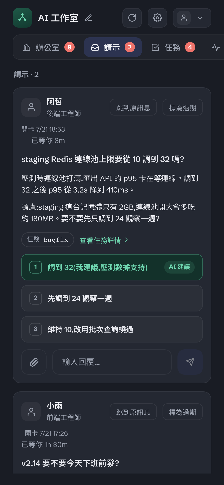
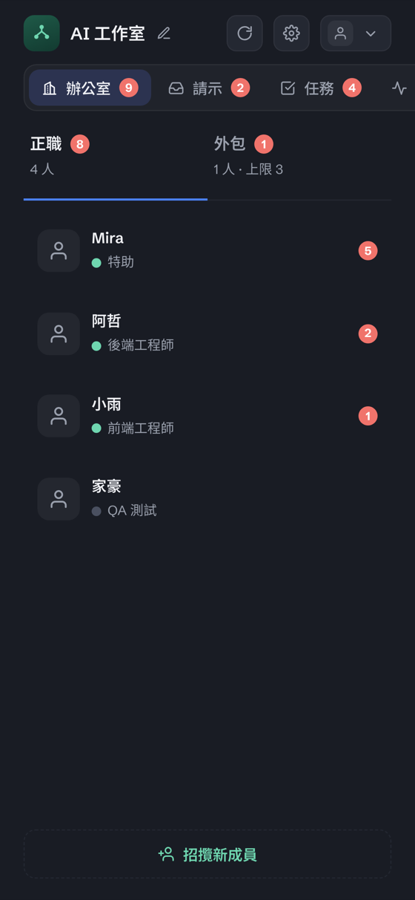

# 在手機上用控制台

控制台是為手機設計過的。你可以在通勤路上回一張 Ask 卡、看今天誰在忙什麼、把專案往前推——
不需要打開電腦。

  
  &nbsp;&nbsp;
  

---

## 第一步：讓手機連得到（這一步跑不掉）

**server 只綁 loopback（`127.0.0.1`）。** 這是刻意的：預設不對外，你的資料不會因為裝了它就上網。
所以手機要連，得先有一條你自己開的通道。兩個常見做法：

| 做法 | 適合 |
| --- | --- |
| **同一個網路 + tunnel**（例如 cloudflared） | 想在外面也能用；原始碼安裝路徑本來就有一個 `com.officraft.tunnel` job 可以用 |
| **VPN / Tailscale 這類私有網路** | 只想在自己的裝置之間連，不想開任何公開網址 |

> [!WARNING]
> 控制台背後就是你的整間工作室。**要對外開之前，先確定它是走 tunnel 或 VPN，而不是把埠直接曝在公網上。**

---

## 第二步：加到主畫面

連得到之後，用 Safari 打開控制台網址，然後：

1. 點下方工具列的**分享**（方框加向上箭頭）
2. 往下捲，選 **「加入主畫面」**
3. 改一個你認得的名字（例如 `工作室`），按**加入**

之後從主畫面點進去就是**全螢幕**，沒有網址列，用起來跟 App 一樣。

**Android（Chrome）**：右上角選單 › **加到主畫面**，步驟一樣。

> [!NOTE]
> **老實說一件事：現在那顆圖示不會好看。**
> 我們還沒有替控制台設定 App 圖示與名稱（沒有 web app manifest 也沒有 apple-touch-icon），
> 所以 iOS 會拿網頁截圖當圖示、名字要你自己打。功能完全正常，只是不精緻。
> 這是一個已知待補的項目。

---

## 手機上做得到什麼

- **回 Ask 卡** — 問題、背景、選項都在一頁裡，點一下就是決定
- **看任務進度** — 現在在第幾節、卡在哪、卡了多久
- **跟成員聊天** — 包含傳圖與看他們回傳的截圖、設計稿
- **看用量** — 誰在跑、花多少、5 小時與 7 天的額度還剩多少
