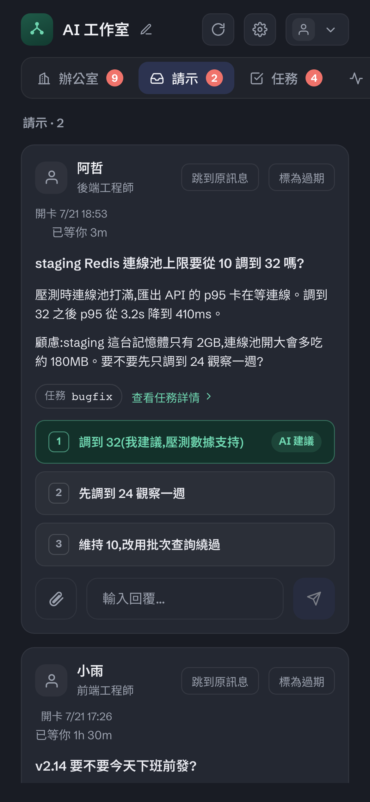
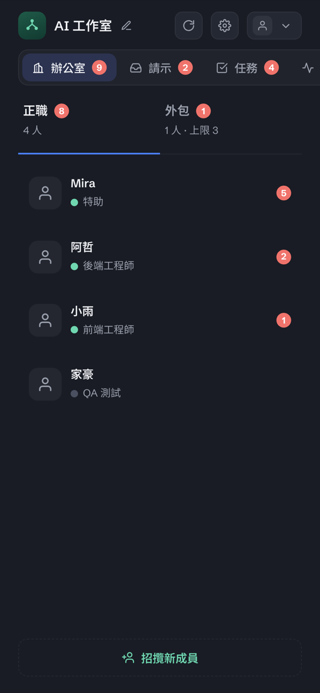

# 在手機上用控制台

控制台是為手機設計過的。你可以在通勤路上回一張 Ask 卡、看今天誰在忙什麼、把專案往前推——
不需要打開電腦。

（以上兩張截圖攝於「使用說明」成為主頁籤之前，所以頁籤列只有四顆。手機上的頁籤列本來就可以左右滑動——圖中第四顆「監控」已經被切在右緣——加上第五顆之後，最右邊的「使用說明」在較窄的手機上會被切到，往右滑就看得到完整的一顆。）

---

## 第一步：讓手機連得到（這一步跑不掉）

**server 只綁 loopback（`127.0.0.1`）。** 這是刻意的：預設不對外，你的資料不會因為裝了它就上網。
所以手機要連，得先有一條你自己開的通道。兩個常見做法：

| 做法 | 適合 |
| --- | --- |
| **tunnel**（例如 cloudflared） | 想從外面／手機也能用：tunnel 給你一個公開 **HTTPS** 網址，配上你設的密碼就能連。tunnel 是你自己開的（我們不代開）；若你走原始碼安裝又已自備 cloudflared，有個選配的 `com.officraft.tunnel` job 可以把它跟 server 一起帶起來 |
| **VPN / Tailscale 這類私有網路** | 只想在自己的裝置之間連，不想開任何公開網址 |

> [!TIP]
> 想從手機／外面用是沒問題的——走一條 tunnel（如 cloudflared，會給你 HTTPS ＋ 你的密碼保護），並設一組夠強的密碼。**別把 server 掛到沒有 HTTPS 的裸公開埠上**：控制台背後就是你的整間工作室。

> [!IMPORTANT]
> **開了對外通道，就把兩步驟驗證一起開起來。**
> loopback-only 的預設之下，密碼是「已經在這台機器上的人」才碰得到的東西；一旦你開了 tunnel，它就變成任何找到那個網址的人都可以對著猜的東西。
> 兩步驟驗證**預設是關閉的**——升級到有這個功能的版本，不會改變你原本的登入方式。要用它得先開放：座艙右上角的頭像 →〈兩步驟驗證〉→「為這台伺服器開放兩步驟驗證」。這一步只是讓設定選項出現，不會替任何人開啟。
>
> 開放之後，同一個地方就能設定。畫面會給你一張 **QR code**、一組可複製的**設定金鑰**，還有一個 `otpauth://` 連結：用驗證器 App（Google Authenticator、1Password、iOS 內建的都行）掃 QR，或在手機上直接點那個連結，或把金鑰手動輸入——三條路都通。加好之後輸入你的密碼與 App 顯示的驗證碼確認，之後每次登入都要多輸入一組 6 位數驗證碼。
>
> QR 是在你的瀏覽器裡畫出來的，**secret 不會送到任何第三方**。萬一畫不出來（例如組織名稱太長、超出 QR 容量），畫面會只留下金鑰與連結——那兩條路本來就足夠完成設定。
> 登入本身也有煞車，而且刻意設計成**不會把你自己鎖在門外**：每一次失敗的登入都會固定花掉約三秒才回答你，密碼打對就立刻放行、完全不用等；同一時間最多只有四個登入在驗證。合起來就是別人一秒鐘大概只猜得動一次多一點，猜密碼在這裡划不來。
>
> ⚠️ 講精確一點，因為這裡很容易被讀成過度樂觀的版本：**沒有任何人可以把你鎖在門外**——系統不再累積「失敗次數」這種東西，別人怎麼試都不會留下任何痕跡，所以他一停手，你下一次用正確密碼就立刻進得去。但**如果他正在猛打**，那四個驗證名額可能剛好都被佔著，這時候連你也會被請稍候（畫面會告訴你等幾秒）。這是刻意的：如果正確的密碼可以插隊，那本身就等於在告訴對方「你剛剛猜對了」。差別在於**等一下**，不是**進不去**。
>
> 另外一件值得知道的事：如果有人**密碼打對、但第二階段驗證碼打錯**，那代表密碼已經流出去了。這種情況伺服器會發訊息給你的助理，請她提醒你換密碼（同一段時間內只會發一則，裡面附上累計次數）。
> 驗證器掉了怎麼辦？在**這台機器上**執行 `ocserverd mfa-disable` 就能關掉——它證明的是「你摸得到這台機器」，跟第一次安裝時那組 claim code 是同一個道理。
> 把功能「關閉」跟「把已開啟的第二因子拿掉」是兩件事：關閉只是把設定入口收起來，**已經開啟的人登入時仍然會被要求驗證碼**，也仍然可以正常關掉。這是刻意的——否則被偷走登入狀態的人只要把功能關掉，就繞過了第二因子。
>
> ⚠️ **跑完要重啟 server 才會生效**：那道指令改的是資料庫，而正在跑的 server 是開機時把設定讀進記憶體的，沒重啟就還是會跟你要驗證碼。會用到這條路的人本來就已經被鎖在外面，別讓他以為是這條路壞了。

---

## 第二步：加到主畫面

連得到之後，用 Safari 打開控制台網址，然後：

1. 點下方工具列的**分享**（方框加向上箭頭）
2. 往下捲，選 **「加入主畫面」**
3. 改一個你認得的名字（例如 `工作室`），按**加入**

之後從主畫面點進去就是**全螢幕**，沒有網址列，用起來跟 App 一樣。

**Android（Chrome）**：右上角選單 › **加到主畫面**，步驟一樣。

控制台已提供名稱、App 圖示與安裝資訊；加到主畫面後會以 OffiCraft 的獨立 App 形式開啟。

---

## 推播通知

在控制台頂端選 **「開啟通知」**，允許瀏覽器權限後，這台裝置會在新訊息與需要你決定的 Ask 卡到達時收到通知；點通知會回到對應聊天或 Ask 頁。

- 桌面版 Chrome、Firefox、Edge、Safari 與 Android Chrome 都支援。
- iPhone／iPad 需要 **iOS/iPadOS 16.4 以上**，而且必須先依上面的步驟加入主畫面，從安裝的 PWA 開啟後才能啟用推播。
- 若先前封鎖過通知，請到瀏覽器或系統設定中重新允許 OffiCraft。

---

## 手機上做得到什麼

- **回 Ask 卡** — 問題、背景、選項都在一頁裡。選項前面**有序號 1/2/3/4 的是單選卡：點一下那個選項就是決定**，當場送出、收不回來；**前面是打勾框的是多選卡**，可以一次勾好幾個（一打開就已經幫你勾好「AI 建議」的那幾個），勾好再按送出
- **看任務進度** — 現在在第幾節、卡在哪、卡了多久
- **跟成員聊天** — 包含傳圖與看他們回傳的截圖、設計稿
- **看用量** — 誰在跑、花多少、5 小時與 7 天的額度還剩多少

---

## 相關文件

- 連不上、加到主畫面卡住 → [常見問題與排解](troubleshooting.md)
- 控制台每個欄位是什麼 → [介面說明](interface.md)
- server 為什麼只綁 loopback → [架構與運作原理](architecture.md)
