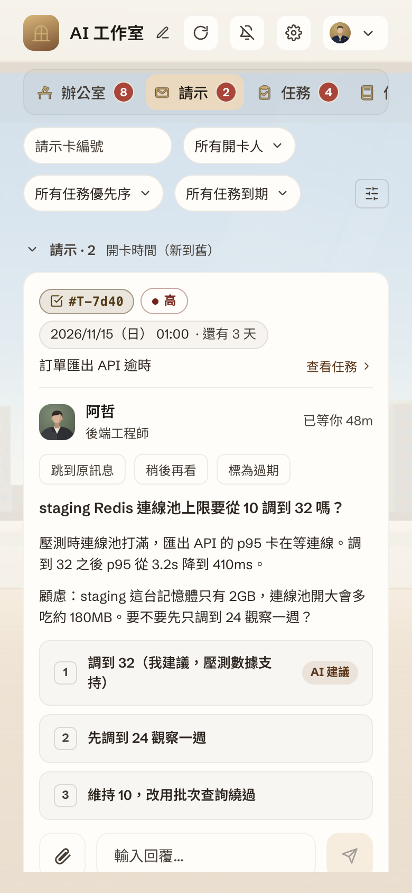

# 在手機上用

這頁說明手機怎麼連上控制台、手機上能用哪些功能，以及推播通知。

## 讓手機連得到控制台

控制台**只接受裝 OffiCraft 的那台電腦本身的連線**，這一點不能改。要從手機連，對 Mira 說「**我想從這台電腦以外的地方連到控制台**」，Mira 會設定轉發工具，最後給你手機用的網址。

- **開放之前一定要開啟兩步驟驗證。** 拿到網址的人都打得開登入頁；通行密鑰不能取代兩步驟驗證，有通行密鑰時仍然可以只用密碼登入。
- **電腦關機或睡眠時，手機連不到控制台。**

## 在手機上登入

手機和電腦一樣用密碼與兩步驟驗證登入，也可以新增通行密鑰，改用 Face ID 或指紋登入。**通行密鑰要在手機上、用轉發後的網址新增**；在電腦上用 `localhost` 網址新增的通行密鑰，手機上不能用。

## 主畫面與推播通知

- **加到主畫面**：用 Safari 的「分享 › 加入主畫面」或 Chrome 選單的「加到主畫面」，之後控制台會像獨立 App 一樣全螢幕開啟。
- **推播通知**：有新訊息或需要你決定的請示時，這台裝置會收到通知，點通知會回到對應的聊天室或請示頁。在頭像選單填好「通知信箱」，再點頂端的鈴鐺圖示開啟。

要注意：

- **iPhone、iPad 要先加到主畫面**，從主畫面打開控制台後才能開啟通知，系統也要是 iOS／iPadOS 16.4 以上。
- 每台裝置要各自開啟一次。
- 通知信箱會提供給瀏覽器廠商經營的推播服務，不會只留在你的伺服器上。

## 手機上的畫面

手機和電腦的功能相同，只是一次只顯示一個區塊：「辦公室」先顯示成員名單，點成員進入聊天室；「請示」可以直接回覆請示卡；「任務」看每張任務的狀態、步驟和備註。

## 相關文件

- [保護你的工作室](security.md)
- [交代工作與回覆請示卡](daily.md)
- [追蹤任務進度](tasks.md)
- [常見問題與排解](troubleshooting.md)
