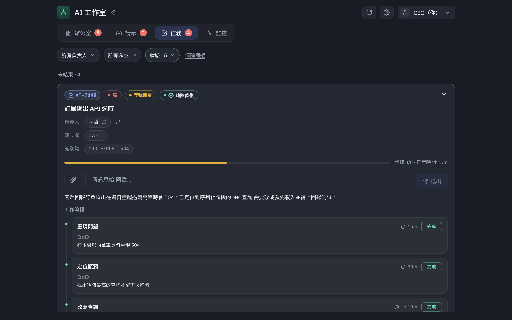

# 任務是怎麼運作的

這份文件回答三件事：**任務的核心設計是什麼**、**你怎麼把一件事交出去**、**AI 怎麼把它變成可追蹤的結構**。

---

## 核心設計：一句話

> **任務不是一個指令，是一條帶「完成定義」的多節點工作流。**

差別在這裡：你跟聊天機器人說「幫我 review 這個 PR」，它做完就沒了，中間發生什麼你看不到，卡住了它可能自己亂猜。
在 OffiCraft 裡，同一句話會變成一張**任務卡**：拆成幾個節點、每個節點寫明「怎樣算做完」、做完一個回報一個、需要你決定的地方**停下來等你**。

你隨時看得到：**現在在第幾節、為什麼卡、卡了多久。**



---

## 人給的是「怎麼做」，AI 給的是「這次怎麼拆」

這是整個設計最關鍵的一刀：

| | 誰寫的 | 是什麼 | 存在哪 |
| --- | --- | --- | --- |
| **任務手冊** | **你**（一次性） | 這一「類」工作的標準流程（SOP）、用途、要哪些欄位 | 設定 › 任務手冊，跨任務長期存在 |
| **任務計畫** | **AI**（每次） | 這一「張」任務實際拆成哪幾節、每節的完成定義 | 任務卡上，這張做完就結束 |
| **學習經驗** | **AI**（結案時回寫） | 這類工作下次怎麼做更好、前人踩過什麼坑 | 回寫進同一本手冊，下一個人開工前先讀 |

**手冊是藍本，不是鐐銬。** AI 拿著手冊的 SOP 當骨架，再照這張任務的實際情況調整。
**而且它會愈用愈準**——每一張結案的任務都會把教訓寫回同一本手冊。

---

## 完整例子：一個 PR 連結進來 → review → 回覆意見

### 第一步：你建一本手冊（只做一次）

**設定 › 任務手冊 › 新增**，填一個類型代號，例如 `review-pr`。手冊出廠是空的，靠三題把它問出來：

**Q1 · 這是什麼任務（用途）**

> 有人丟一個 PR 連結進來（Slack、你自己在控制台貼、或任何入口都算），要有人去看完、給出可執行的意見。
> 目標是「作者看完就知道要改哪裡」，不是「留一句 LGTM」。

**Q2 · 要哪些欄位**（每個欄位可標「必填」、可標「識別鍵」）

| 欄位 | 必填 | 識別鍵 |
| --- | --- | --- |
| `pr_url` | ✅ | ✅ |
| `slack_thread`（從哪串對話進來的，有就填） | | |
| `focus`（這次特別想看什麼） | | |

> 🔑 **識別鍵是防重複的機制。** 同一個 `pr_url` 再進來一次，系統會認出「這件事已經有一張卡了」，不會開第二張。
>
> **挑識別鍵的判準：選「這件事是什麼」，不要選「這次是怎麼進來的」。**
> 這裡的身分是那個 PR，所以識別鍵只有 `pr_url`。
> 如果把 `slack_thread` 也放進識別鍵，同一個 PR 從另一串 thread 被提起、或你直接在控制台貼連結（根本沒有 thread），
> 就會被當成不同的事而開出第二張卡——**防重複剛好在最該生效的時候失效。**
>
> 識別鍵可以複合，但複合的每一個欄位都必須是身分的一部分（例如「同一個 repo 的同一個版本號」）。

**Q3 · 該怎麼做（SOP，這會變成 AI 拆節點的藍本）**

```markdown
1. 讀 PR：抓 diff、看 CI 綠不綠、確認它宣稱要解的問題是什麼。
2. 對照票面：它真的解到那個問題了嗎？有沒有解過頭？
3. 三個角度各看一遍：正確性 / 測試涵蓋 / 對既有行為的破壞面。
4. 產出結論檔：每一條 finding 要有「檔案:行號 + 為什麼是問題 + 建議怎麼改」。
5. 在 PR 上留 approve / request-changes 與結論摘要。若這件事是從某串對話進來的，順手把摘要貼回去。

邊界：
- 不要自己動手改對方的碼。
- 拿不準「這是既有缺陷還是這包造成的」時，開卡問，不要猜。
```

### 第二步：任務進來

連結可以從**回呼端點（webhook）**打進來（例如接上 Slack），也可以是你直接在控制台丟一句「幫我看這個 PR」——**對任務來說是同一件事**，入口不影響它的身分。
系統認出它屬於 `review-pr` 這一類、把它指派給這本手冊設定的負責成員（可以是常駐成員，也可以是**外包**——臨時開、做完就收）。

### 第三步：AI 把它拆成計畫

負責的成員**先讀手冊**（SOP + 前人的學習經驗），再照這張的實況拆：

| # | 節點 | 完成定義（DoD） |
| --- | --- | --- |
| 1 | 抓 PR 與 CI 狀態 | diff 已取得、CI 結論已記錄（綠/紅 + 失敗的是哪一項） |
| 2 | 正確性審查 ⟨並行⟩ | 結論落檔 `review-correctness.md`，每條 finding 含檔案:行號與建議 |
| 3 | 測試涵蓋審查 ⟨並行⟩ | 結論落檔 `review-tests.md`，明列「哪些路徑沒有測試」 |
| 4 | 破壞面審查 ⟨並行⟩ | 結論落檔 `review-blast.md`，明列受影響的既有行為 |
| 5 | 匯合：合併三份結論 | 產出單一結論檔，重複的合併、互相矛盾的標出來 |
| 6 | 🚪 要不要 request-changes | **你**在卡上拍板（這步只有你能決定） |
| 7 | 在 PR 上留結論（有 thread 就順手回貼） | PR 上有 approve 或 request-changes，且結論摘要可被作者看到 |

幾個要注意的地方：

- **2、3、4 是平行節點**：互不依賴，同時開三個人各做各的，各自把產出落成**自己的檔案**（不共用一個檔）。
- **平行段後面一定接一個「匯合節點」**（第 5 節）：把各路產出合成一份。
- **第 6 節是關卡（gate）**：AI 自己驗收不了、只有你能決定的事。走到這裡它會開一張 Ask 卡停下來等你，**而且這個關卡在計畫送出的當下就先標出來了**——你一眼就知道「這件事後面會需要我點頭一次」。

---

## 任務的狀態

| 狀態 | 意思 |
| --- | --- |
| **尚未執行** | 卡已經開了，還沒動工 |
| **進行中** | 正在推 |
| **等我回覆** | 卡在你身上——有一張 Ask 卡在等你回 |
| **等待外部** | 卡在第三方：權限還沒開通、對方還沒回信、時間窗還沒到 |
| **已完成 / 終止 / 重複** | 三個終態 |

兩個容易搞混的：

- **「等我回覆」是卡片造成的，不是 AI 自己報的。** 開了 Ask 卡才會進去，你一回答就自動退回「進行中」。
- **「等待外部」不包含「等 CI 跑完」。** CI 是自家流程裡的長時作業，那還是「進行中」。**等待外部是指這件事不在我們手上。**

另外還有兩個工具處理現實的雜訊：

- **依賴（被誰擋住）**：這張要等另一張先完成 → 標記出來，先去做別的，不要空轉。
- **重複**：發現這張跟舊的那張是同一件事 → 指回原票收掉，不用麻煩你一張一張關。

---

## 節點（step）與完成定義（DoD）

每個節點只有兩樣東西：**名稱**、**完成定義**。

**好的 DoD 是「可觀察的結果」，不是「要做的動作」：**

| ❌ 不好 | ✅ 好 | 為什麼 |
| --- | --- | --- |
| 跑一下測試 | 全部測試通過，且新增的三條護欄各自實測會擋 | 前者是動作，事後無從判斷真假 |
| 處理好 PR | PR 上留下 approve 或 request-changes 的結論 | 前者主觀，兩個人會有兩種解讀 |
| 等部署完成 | 已發佈到 registry、健康檢查通過 | 前者沒說怎樣才算完成 |

**判準只有一個：讀完這句話，任何人都能客觀判斷它有沒有達成。** 做不到就重寫。

一個 DoD 只講一個結果。塞兩件事進去，就會出現「一半做完」這種無法判定的狀態——那就該拆成兩節。

---

## 為什麼要這麼麻煩？

因為**沒有完成定義的工作，AI 一定會回報「做好了」**，而你要自己去查它到底做了什麼。
DoD 把「做好了」變成一句可以驗證的話——**它不是給 AI 的規矩，是給你的槓桿。**

---

**任務手冊放在**：設定 › 任務手冊（出廠是空的，你建幾本就有幾本）。
**手冊的負責成員只有你能指定**——那是治理面的設定，AI 自己改不了。
