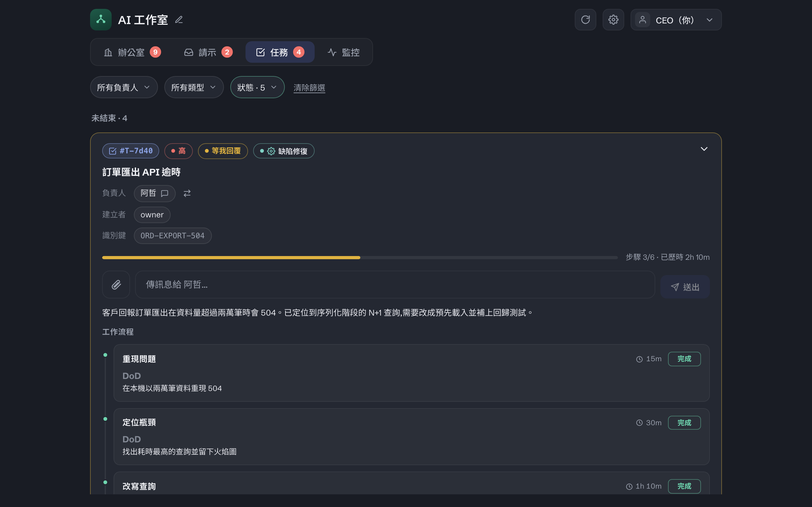

# 任務是怎麼運作的

這份文件回答三件事：**任務的核心設計是什麼**、**你怎麼把一件事交出去**、**AI 怎麼把它變成可追蹤的結構**。

---

## 核心設計：一句話

> **任務不是一個指令，是一條帶「完成定義」的多節點工作流。**

差別在這裡：你跟聊天機器人說「幫我 review 這個 PR」，它做完就沒了，中間發生什麼你看不到，卡住了它可能自己亂猜。
在 OffiCraft 裡，同一句話會變成一張**任務卡**：拆成幾個節點、每個節點寫明「怎樣算做完」、做完一個回報一個、需要你決定的地方**停下來等你**。

你隨時看得到：**現在在第幾節、為什麼卡、卡了多久。**



（此截圖攝於「使用說明」成為主頁籤之前，所以上方頁籤列只有四顆；任務卡本身不變。）

---

## 人給的是「怎麼做」，AI 給的是「這次怎麼拆」

這是整個設計最關鍵的一刀：

| | 誰寫的 | 是什麼 | 存在哪 |
| --- | --- | --- | --- |
| **任務手冊** | **你或成員**（一次性） | 這一「類」工作的標準流程（SOP）、用途、要哪些欄位 | 設定 › 任務手冊，跨任務長期存在 |
| **任務計畫** | **AI**（每次） | 這一「張」任務實際拆成哪幾節、每節的完成定義 | 任務卡上，這張做完就結束 |
| **學習經驗** | **AI**（結案後自己回寫） | 這類工作下次怎麼做更好、前人踩過什麼坑 | 回寫進同一本手冊，下一個人開工前先讀 |

**手冊是藍本，不是鐐銬。** AI 拿著手冊的 SOP 當骨架，再照這張任務的實際情況調整。

**手冊的內容誰都能寫，只有「誰負責」那一格是你的。** 用途、欄位、SOP、學習經驗——這四樣一般成員自己就改得動（它們本來就是給 agent 累積用的）。
唯一鎖起來的是**負責成員那一格**：只有你或你的 admin 助理能指定誰接這一類工作，那是治理面。

**而且它會愈用愈準**——但要說清楚**是誰在寫**：**回寫學習經驗是執行成員自己的收尾義務，不是系統自動做的。**
任務關掉的時候，server **不會**替你把教訓寫進手冊；它只是往還在線上的執行成員推一則提醒，請它自己回寫。
所以：**成員當下不在線就收不到那則提醒**，而**判為重複的任務、以及沒有手冊的臨時任務根本不發**（重複的沒有教訓可言）。手冊會不會變厚，取決於成員有沒有照 SOP 收尾。

---

## 完整例子：一個 PR 連結進來 → review → 回覆意見

### 第一步：你建一本手冊（只做一次）

**設定 › 任務手冊 › 新增**，填一個類型代號，例如 `review-pr`。手冊出廠是空的，靠三題把它問出來：

**Q1 · 這是什麼任務（用途）**

> 有人丟一個 PR 連結進來（Slack、你自己在控制台貼、或任何入口都算），要有人去看完、給出可執行的意見。
> 目標是「作者看完就知道要改哪裡」，不是「留一句 LGTM」。

**Q2 · 要哪些欄位**（每個欄位可標「必填」、可標「識別鍵」）

| 欄位 | 必填 | 識別鍵 |
| --- | --- | --- |
| `pr_url` | ✅ | ✅ |
| `slack_thread`（從哪串對話進來的，有就填） | | |
| `focus`（這次特別想看什麼） | | |

> 🔑 **識別鍵是防重複的機制。** 同一個 `pr_url` 再進來一次，只要那張舊卡**還沒結案**（尚未完成／終止／判為重複），系統就會認出「這件事已經有一張卡了」，不會開第二張。
>
> **去重只擋還沒結案的任務。** 舊卡一旦結案，同一個 `pr_url` 之後再進來會開一張新的——同一個 PR 隔一週再被提起，本來就該重新做一次。
>
> **挑識別鍵的判準：選「這件事是什麼」，不要選「這次是怎麼進來的」。**
> 這裡的身分是那個 PR，所以識別鍵只有 `pr_url`。
> 如果把 `slack_thread` 也放進識別鍵，同一個 PR 從另一串 thread 被提起、或你直接在控制台貼連結（根本沒有 thread），
> 就會被當成不同的事而開出第二張卡——**防重複剛好在最該生效的時候失效。**
>
> 識別鍵可以複合，但複合的每一個欄位都必須是身分的一部分（例如「同一個 repo 的同一個版本號」）。

**Q3 · 該怎麼做（SOP，這會變成 AI 拆節點的藍本）**

```markdown
1. 讀 PR：抓 diff、看 CI 綠不綠、確認它宣稱要解的問題是什麼。
2. 對照票面：它真的解到那個問題了嗎？有沒有解過頭？
3. 三個角度各看一遍：正確性 / 測試涵蓋 / 對既有行為的破壞面。
4. 產出結論檔：每一條 finding 要有「檔案:行號 + 為什麼是問題 + 建議怎麼改」。
5. 在 PR 上留 approve / request-changes 與結論摘要。若這件事是從某串對話進來的，順手把摘要貼回去。

邊界：
- 不要自己動手改對方的碼。
- 拿不準「這是既有缺陷還是這包造成的」時，開卡問，不要猜。
```

### 第二步：任務進來

連結可以從**回呼端點（webhook）**打進來（例如接上 Slack），也可以是你直接在控制台丟一句「幫我看這個 PR」——**對任務來說是同一件事**，入口不影響它的身分。
它被認出屬於 `review-pr` 這一類、指派給這本手冊設定的負責成員（可以是常駐成員，也可以是**外包**——臨時開、做完就收）。

> ⚠️ **「認出這是哪一類」是收訊的那個成員做的，不是伺服器自動分類的。** server 收到 webhook 只做一件事：把它變成一則聊天訊息丟給對應的成員。
> 成員收到後照它的行為準則先去列一遍現有的任務手冊、拿各本手冊的「這是什麼任務」比對，判出類別才開票。
> 所以**手冊的「用途」那一段就是分類的依據**——寫得含糊，分類就會歪。
> 至於**沒有任何一本手冊接得住的請求**：成員不會硬塞進某一類，也不會預設回頭問你，它會**開一張沒有類型的「自由代辦」任務自己接下來**（沒有手冊可參考，直接照你的需求從頭拆節點）。
> 這正是「同一型請求出現第三次就該建手冊」的訊號——在那之前它照樣做得動，只是每次都得從頭想一遍。

### 第三步：AI 把它拆成計畫

負責的成員**先讀手冊**（SOP + 前人的學習經驗），再照這張的實況拆：

| # | 節點 | 完成定義（DoD） |
| --- | --- | --- |
| 1 | 抓 PR 與 CI 狀態 | diff 已取得、CI 結論已記錄（綠/紅 + 失敗的是哪一項） |
| 2 | 正確性審查 ⟨並行⟩ | 結論落檔 `review-correctness.md`，每條 finding 含檔案:行號與建議 |
| 3 | 測試涵蓋審查 ⟨並行⟩ | 結論落檔 `review-tests.md`，明列「哪些路徑沒有測試」 |
| 4 | 破壞面審查 ⟨並行⟩ | 結論落檔 `review-blast.md`，明列受影響的既有行為 |
| 5 | 匯合：合併三份結論 | 產出單一結論檔，重複的合併、互相矛盾的標出來 |
| 6 | 🚪 要不要 request-changes | **你**在卡上拍板（AI 自己決定不了；你的 admin 助理可以代你答） |
| 7 | 在 PR 上留結論（有 thread 就順手回貼） | PR 上有 approve 或 request-changes，且結論摘要可被作者看到 |

幾個要注意的地方：

- **2、3、4 是平行節點**：互不依賴，同時開三個人各做各的，各自把產出寫成**自己的檔案**（不共用一個檔）。
- **平行段後面該接一個「匯合節點」**（第 5 節）：把各路產出合成一份。⚠️ **這是規劃紀律，不是系統擋得住的事**——server 對**平行段的形狀**只驗三件事：關卡不能放在平行段裡面、同一個平行段的節點必須排在一起、一個平行段至少要兩節。**「有沒有匯合」它不檢查**，所以少了匯合節點的計畫照樣送得出去，三份結論就這樣散在那裡沒人合。這一條要靠寫計畫的人自己守。
- **第 6 節是關卡（gate）**：AI 自己驗收不了、要你拍板的事。走到這裡它會開一張 Ask 卡停下來等你——**你的 admin 助理也可以代你答掉這張卡**，但一般成員不行（包括開卡的那個成員自己）。**而且這個關卡在計畫送出的當下就先標出來了**——你一眼就知道「這件事後面會需要我點頭一次」。
- **但「預先標關卡」只是預告，不是開卡的唯一條件。** 成員走到任何一個**還沒結束**的節點，只要真的拿不準，都可以就地開一張卡停下來等你——
  那個節點不需要事先被標成關卡，而且**臨時開卡也不會把它變成關卡**（計畫上的標記不會被改寫）。
  開不了卡的有兩種情形：**節點已經結束**（已完成、或被新計畫取代掉的），或**任務本身不在可開卡的狀態**——只有「進行中」與「等我回覆」的任務收得了新卡，
  一張正卡在「等待外部」的任務是開不出來的（得先讓它回到進行中）。
  所以：**預先標好的關卡＝你事先就知道的那幾次**；**臨時開的卡＝現場才發現需要你的那幾次**。後者本來就該存在——計畫寫的時候不可能預見全部。

---

## 任務的狀態

| 狀態 | 意思 |
| --- | --- |
| **尚未執行** | 卡已經開了，還沒動工 |
| **進行中** | 正在推 |
| **等我回覆** | 卡在你身上——有一張 Ask 卡在等你回 |
| **等待外部** | 卡在第三方：權限還沒開通、對方還沒回信、時間窗還沒到 |
| **已完成 / 終止 / 重複** | 三個終態 |

兩個容易搞混的：

- **「等我回覆」是卡片造成的，不是 AI 自己報的。** 開了 Ask 卡才會進去；你一回答，那張卡綁的節點就自動退回「進行中」。但**同一張任務可以同時掛著好幾張卡**——只要還有別張卡在等你，任務本身就繼續是「等我回覆」。
  最後一張結掉之後，任務落回**它各節點當下的誠實狀態**：可能是「進行中」，但也可能是「等待外部」（還有節點卡在第三方）或「已完成」，不保證是進行中。
- **「等待外部」不包含「等 CI 跑完」。** CI 是自家流程裡的長時間作業，那還是「進行中」。**等待外部是指這件事不在我們手上。**

另外還有兩個工具處理現實的雜訊：

- **依賴（被誰擋住）**：這張要等另一張先完成 → 標記出來，先去做別的，不要空轉。
- **重複**：發現這張跟舊的那張是同一件事 → 指回原票收掉，不用麻煩你一張一張關。

### 上面那七個值不是全部：還有兩樣東西在旁邊

它們**不是狀態**，所以不在上面那張表裡，但你在卡上會看到：

- **「轉派中」是一把鎖，不是狀態。** 任務轉手給別人之後會掛著這把鎖，直到新的執行者認領才解開。
  它**跟狀態同時存在**——你會看到一張「進行中」而且「轉派中」的卡，那不是矛盾，是兩個獨立的維度。
- **「已取代」（superseded）是節點的終態，不是任務的。** 成員重新送一份計畫時，舊計畫裡那些**已經走過、但新計畫沒再列**的節點會凍在這個狀態當歷史。
  它有兩個你該知道的性質：**成員自己報不出這個狀態**（只有重送計畫才會產生），而且**它兩邊都不算**——
  「做完幾步／共幾步」那個數字**兩邊都不算它**，所以重規劃不會讓進度憑空跳動或倒退。

---

## 節點（step）與完成定義（DoD）

每個節點**規劃時**只有兩樣東西：**名稱**、**完成定義**。跑起來之後它身上還會多兩格，都是**成員寫給你和寫給下一手看的**：

| 多出來的那格 | 誰寫 | 什麼時候寫 | 你在哪看到 |
| --- | --- | --- | --- |
| **步驟備註（step note）** | 執行的成員 | **節點在哪個狀態都能寫**（但任務關掉之後就寫不了了） | 節點上的**備註**入口；`get_task` 的節點視圖只報這一格**有幾個字**（`note_size_chars`，0 就是真的沒寫過），**內文要用 `get_task_step` 指名那一節單獨讀** |
| **等待原因（waiting_reason）** | 執行的成員 | 只在把節點推進「等待外部」的那一刻 | 節點上，只在它是「等待外部」的時候 |

（卡上那顆入口只寫「備註」兩個字，指的就是這一格。）

**步驟備註是交接機制在靠的東西，值得單獨講。** 成員的記憶快滿時會換手（見 [名詞表](glossary.md) 的 handover），
退場前它照 SOP 要把「做到哪、下一步接什麼」寫進**當前節點的步驟備註**——那是新接手的它最先讀到的**節點級**現場紀錄。
（不是唯一的線索：它另外還有上一手留的交接 baton／resume 快照、前一手發給自己的那則訊息，必要時也能直接去問前任本人。
但那幾樣講的是「這個成員整體在忙什麼」，**只有步驟備註是綁在這一節上的**——「這一步做到哪」要看它。）

**接手的人要把它讀回來，得走兩步。** 先 `get_task` —— 它列出這張票的每一節（沒有截斷、沒有分頁），每一節帶著 `note_size_chars`：
**不是 0 的那幾節就是有東西在等你**，順手也拿到那一節的 step id。再用 `get_task_step(task_id, step_id)` 指名那一節，
才會拿到備註全文。所以**「哪幾節有備註」跟「備註寫了什麼」是兩次呼叫**——先看數字挑要讀的，不要把整張票的備註全撈回來。

它跟「等待原因」是兩格不同的東西，不要混：**等待原因綁死在一個狀態上**（進「等待外部」時才寫得了，離開就被清掉），
**步驟備註不綁狀態**，正在跑、卡住、等你回覆都寫得動——交接可能發生在任何一刻，這格的「不挑時候」就是它存在的理由。

> 你自己不用寫這一格，但**值得看**：任務停在那裡沒動的時候，先看它最近一次寫了什麼，往往比問它更快。

**好的 DoD 是「可觀察的結果」，不是「要做的動作」：**

| ❌ 不好 | ✅ 好 | 為什麼 |
| --- | --- | --- |
| 跑一下測試 | 全部測試通過，且新增的三條護欄各自實測會擋 | 前者是動作，事後無從判斷真假 |
| 處理好 PR | PR 上留下 approve 或 request-changes 的結論 | 前者主觀，兩個人會有兩種解讀 |
| 等部署完成 | 已發佈到 registry、健康檢查通過 | 前者沒說怎樣才算完成 |

**判準只有一個：讀完這句話，任何人都能客觀判斷它有沒有達成。** 做不到就重寫。

一個 DoD 只講一個結果。塞兩件事進去，就會出現「一半做完」這種無法判定的狀態——那就該拆成兩節。

---

## 為什麼要這麼麻煩？

因為**沒有完成定義的工作，AI 一定會回報「做好了」**，而你要自己去查它到底做了什麼。
DoD 把「做好了」變成一句可以驗證的話。

這件事有兩層，別混在一起：

- **對 AI 是硬規矩。** 送計畫時**每一節都必須帶 DoD**，空白或漏填會被 server 直接退回（400），整份計畫一個字都不會寫進去。這不是勸告，是關得死的門。
- **對你是槓桿。** server 擋得住「有沒有寫」，擋不住「寫得好不好」——「跑一下測試」也是一句 DoD，照樣過得了門。**能不能事後客觀驗收，取決於那句話寫成什麼樣**，而那正是你看得懂、也管得動的地方。

---

**任務手冊放在**：設定 › 任務手冊（出廠是空的，你建幾本就有幾本）。
**手冊的負責成員只有你或你的 admin 助理能指定**——那是治理面的設定，一般成員改不了。

---

## 相關文件

- 手冊可以指派給外包、一次跑幾份 → [成員與外包](members.md)
- 怎麼把手冊寫好、識別鍵怎麼挑、gate 開在哪 → [建議用法](best-practices.md)
- 設定頁的任務手冊子頁 → [設定與參數](settings.md)
- 名詞定義 → [名詞表](glossary.md)
